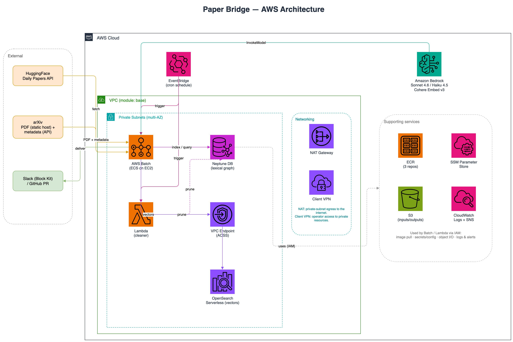
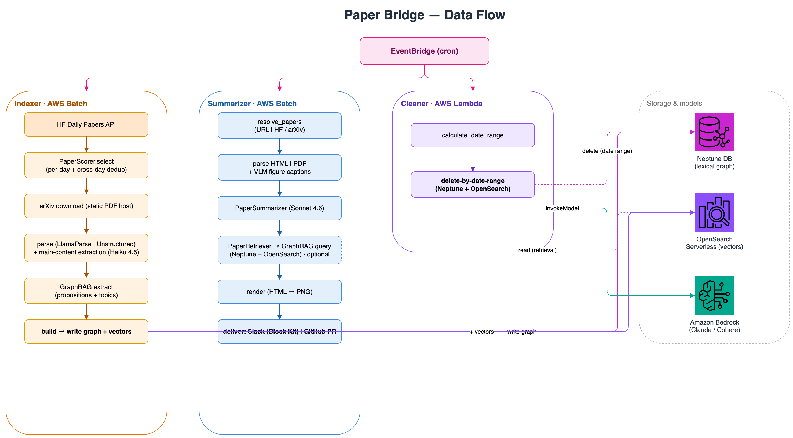

<div align="center">

# 🗞️ Paper Bridge

**그날 가장 많이 회자된 AI/ML 논문을 짧고 신뢰할 수 있는 브리핑으로 — 지식 그래프로 관련 연구와 비교해 맥락 속에 놓습니다.**

AWS 위 일간 arXiv 파이프라인 · GraphRAG (Neptune + OpenSearch) · Amazon Bedrock (Claude) 기반.

[](https://github.com/bits-bytes-nn/paper-bridge/actions/workflows/ci.yml)


-green)

🇺🇸 [English README](./README.md)

</div>

---

**Paper Bridge**는 그날 가장 많이 회자된 AI/ML 논문들을 짧고 신뢰할 수 있는 브리핑으로 만들어 줍니다. 핵심은 단순 요약이 아니라, 각 논문을 지식 그래프로 **관련 연구와 비교해 맥락 속에 놓는다**는 점입니다.

[HuggingFace Daily Papers](https://huggingface.co/papers) 피드를 읽어 들이고, 수집한 논문으로 **GraphRAG 어휘 그래프(lexical graph)** 를 구축한 뒤 다음과 같은 질문에 답합니다.

- *"이 논문의 세부 기술 분야에서 최근 어떤 주요 발전이 있었는가?"*
- *"같은 문제를 푸는 다른 최신 논문들과 이 논문은 무엇이 다른가?"*

결과는 매일 자동으로 **Slack**에 전달되거나 **GitHub 풀 리퀘스트**로 열립니다.

---

## 동작 방식

Paper Bridge는 세 개의 독립적인 워크플로로 이루어집니다. 셋은 하나의 데이터 저장소 쌍(Neptune 그래프 + OpenSearch 벡터 인덱스)을 공유하며, 각자 Amazon EventBridge 스케줄로 실행됩니다.

| 워크플로 | 실행 환경 | 하는 일 |
|----------|-----------|---------|
| **Indexer** | AWS Batch | 후보 논문 수집 → 선정·중복 제거 → PDF 다운로드·파싱 → 본문 추출 → GraphRAG 그래프(Neptune)와 벡터(OpenSearch) 구축. |
| **Summarizer** | AWS Batch | 그날의 논문 선택 → 파싱·그림 캡션 생성 → LLM 요약 → 관련 연구 맥락을 위한 GraphRAG 검색 → 리포트 렌더링 → Slack/GitHub 전달. |
| **Cleaner** | AWS Lambda | 설정한 날짜 범위를 벗어난 문서를 Neptune·OpenSearch 양쪽에서 삭제해 저장소 크기를 일정하게 유지. |

### 아키텍처



### 데이터 흐름



---

## 세 워크플로 자세히 보기

### 1. 인덱싱 (AWS Batch)

1. EventBridge가 스케줄에 맞춰 Batch 작업을 실행합니다.
2. HuggingFace Daily Papers에서 후보 논문을 가져온 뒤, 인기도 + 최신성 스코어러로 **하루 단위 선정 후 여러 날에 걸쳐 중복을 제거**합니다(`shared/paper_selection.py`).
3. PDF는 정적 호스트 `arxiv.org/pdf`에서 직접 내려받고(`Retry-After` 백오프 적용), 메타데이터는 rate-limit을 피하도록 한 번의 배치 호출로 가져옵니다(`shared/arxiv_client.py`).
4. [LlamaParse](https://www.llamaindex.ai/llamaparse) 또는 [Unstructured](https://unstructured.io/)로 텍스트를 파싱합니다.
5. Claude Haiku로 본문만 추출합니다(초록·참고문헌 등은 제외).
6. [AWS GraphRAG 툴킷](https://github.com/awslabs/graphrag-toolkit)으로 Neptune + OpenSearch에 색인합니다.

### 2. 검색 & 요약 (AWS Batch)

1. EventBridge가 스케줄에 맞춰 Batch 작업을 실행합니다.
2. 같은 스코어러로 그날의 상위 논문을 고른 뒤 HTML 또는 PDF를 파싱합니다.
3. 그림을 추출하고 비전 모델로 캡션을 생성합니다.
4. Claude Sonnet으로 논문을 요약한 다음, **GraphRAG 검색**으로 그래프에 이미 있는 관련 연구와 비교합니다.
5. HTML 리포트를 이미지로 렌더링해 **Slack(Block Kit)** 으로 보내거나 **GitHub 풀 리퀘스트**를 엽니다.

### 3. 정리 (AWS Lambda)

스케줄로 실행되는 Lambda가 설정된 날짜 범위를 벗어난 문서를 Neptune·OpenSearch에서 가지치기(prune)하여, 저장소가 끝없이 커지지 않게 합니다.

---

## 모델

모델 선택은 공유 설정에 모아 두고 Amazon Bedrock의 cross-region 추론 프로필로 해석합니다.

| 역할 | 모델 |
|------|------|
| 요약 / GraphRAG 응답 | **Claude Sonnet 4.6** |
| 본문 추출, 그림 캡션 | **Claude Haiku 4.5** |
| 임베딩(1024차원 벡터) | **Cohere Embed English v3** |

---

## 인프라

모든 인프라는 Terraform으로 정의됩니다(`terraform/modules/{base,client,neptune,opensearch}`).

- **네트워크** — VPC, public/private 서브넷, NAT, 선택적 Client VPN, VPC 엔드포인트.
- **데이터** — Amazon Neptune(그래프) + OpenSearch Serverless(벡터).
- **컴퓨팅** — indexer/summarizer는 AWS Batch(ECS on EC2), cleaner는 Lambda.
- **연동** — Amazon Bedrock, EventBridge 스케줄, SSM Parameter Store, S3, ECR, SNS.

---

## 개발

```bash
poetry install              # 의존성 설치 (dev 그룹 포함: pytest, ruff, black, mypy)
poetry run pytest           # 테스트 실행
poetry run ruff check .     # 린트
poetry run black --check .  # 포맷 검사
poetry run mypy paper_bridge/shared   # 타입 검사 (shared/는 차단 게이트)
```

CI는 GitHub Actions에서 돌아갑니다 — 린트, 포맷, 타입 검사, 테스트 + 커버리지, Docker 빌드, `terraform validate`, 보안 스캔. [`.github/workflows/ci.yml`](.github/workflows/ci.yml)을 참고하세요.

---

## 라이선스

MIT — [LICENSE](LICENSE) 참고.
