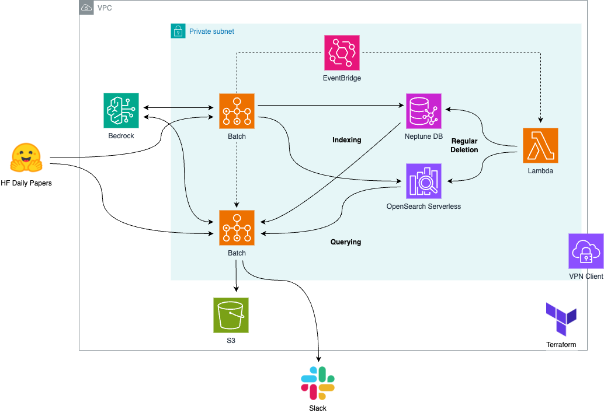

## 🗞️ PAPER-BRIDGE

**Paper Bridge** is a Graph RAG-based application that analyzes technical trends in key AI/ML papers published on [HuggingFace Daily Papers](https://huggingface.co/papers), providing insights by comparing related papers. It helps answer questions like:
- *"What are the recent major developments in the technical field of a given paper?"*
- *"What are the key differences between a given paper and recently published similar papers? Please analyze trends in the research area and provide insights."*

### Architecture

#### Infrastructure Components
- **Network**: VPC, Subnet, Security Group, VPN Client
- **Database**: Neptune DB, OpenSearch Serverless
- **Application**: AWS Batch, Lambda (Bedrock, EventBridge)
- **IaC**: Terraform

### Workflow

#### Indexing Phase
1. EventBridge triggers ECS-based Batch jobs at scheduled times
2. Batch retrieves arXiv IDs of top-voted papers from HF Daily Papers
3. Downloads PDF files and metadata using [arXiv Python API](https://pypi.org/project/arxiv/)
4. Parses text using [LlamaParse](https://www.llamaindex.ai/llamaparse) or [Unstructured](https://unstructured.io/)
5. Removes unnecessary parts (abstracts, references) using LLM
6. Indexes content in Neptune DB and OpenSearch using [AWS GraphRAG toolkit](https://github.com/awslabs/graphrag-toolkit)

#### Search Phase
1. EventBridge triggers ECS-based Batch jobs at scheduled times
2. Batch retrieves arXiv IDs of top-voted papers from HF Daily Papers
3. Parses HTML version if available, otherwise uses [Upstage's DocumentParse](https://www.upstage.ai/products/document-parse)
4. Extracts paper images and generates captions using VLM
5. Summarizes papers and performs search using AWS GraphRAG toolkit
6. Extracts insights, renders HTML summary reports, and delivers to Slack
