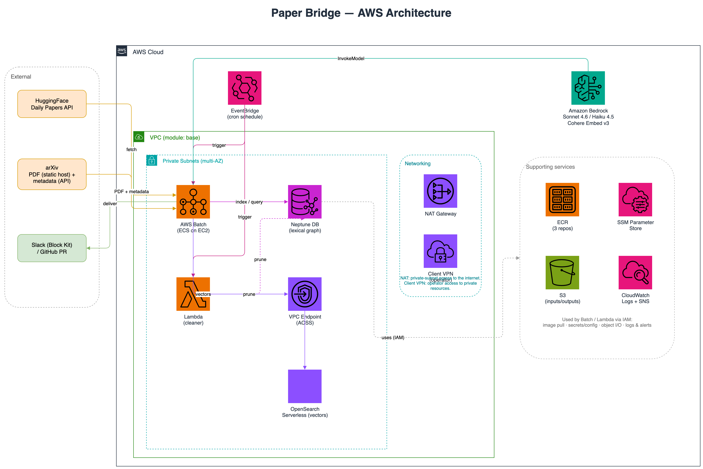
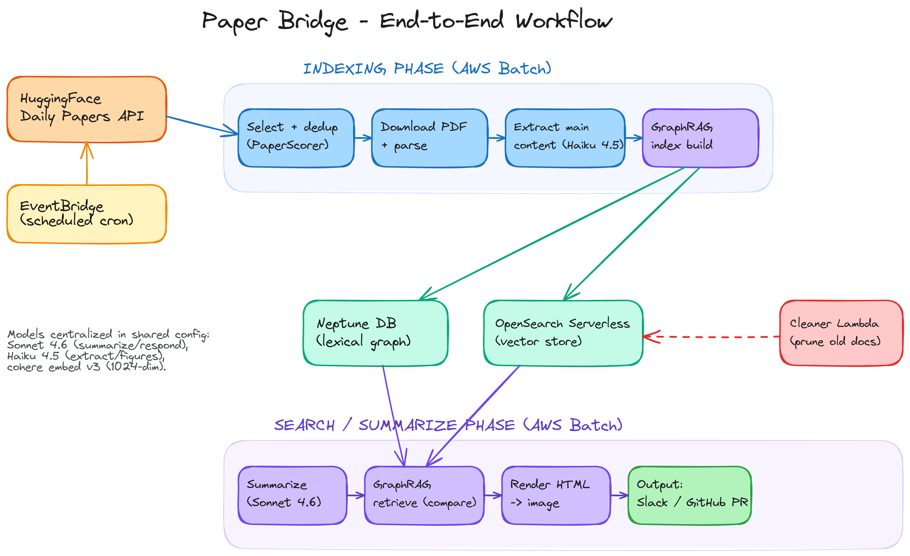
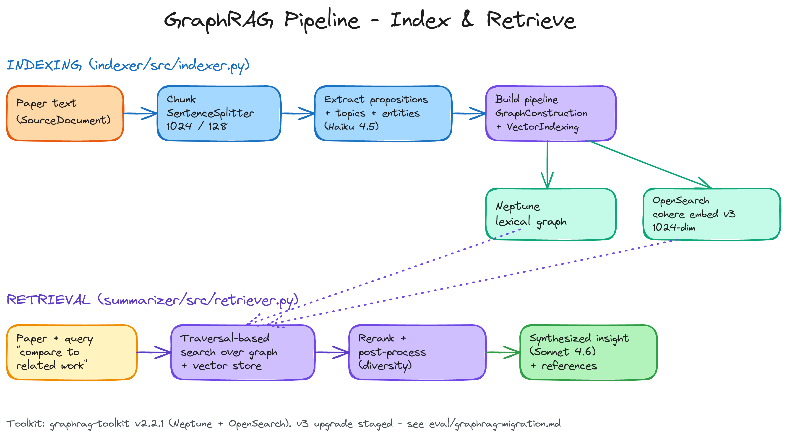
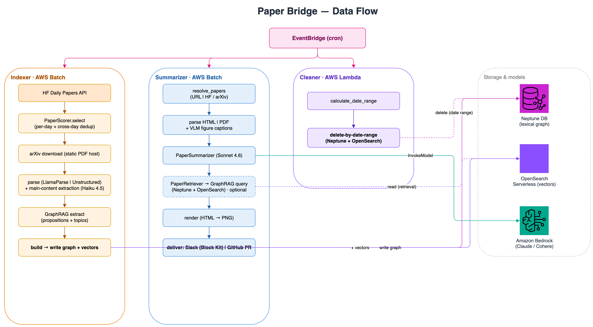

# Paper Bridge — 기술 문서

> Paper Bridge 코드베이스의 단일 진실 공급원(single source of truth)입니다. 이 문서는 새로
> 합류한 엔지니어가 처음부터 온보딩할 수 있도록 작성되었으며, **현재(리팩터링된)** 코드와
> 일치하도록 유지됩니다. 문서에 명시된 수치(chunk 크기, 토큰 한도, Slack 한도, 임베딩 차원
> 등)는 작성 시점의 소스 코드와 일치합니다.

---

## 목차

1. [개요](#1-개요)
2. [아키텍처 한눈에 보기](#2-아키텍처-한눈에-보기)
3. [저장소 레이아웃](#3-저장소-레이아웃)
4. [공유 모듈](#4-공유-모듈)
5. [Indexer 서브시스템](#5-indexer-서브시스템)
6. [Summarizer 서브시스템](#6-summarizer-서브시스템)
7. [Cleaner 서브시스템](#7-cleaner-서브시스템)
8. [설정 레퍼런스](#8-설정-레퍼런스)
9. [모델 & GraphRAG](#9-모델--graphrag)
10. [인프라 (AWS / Terraform)](#10-인프라-aws--terraform)
11. [빌드, 테스트 & CI/CD](#11-빌드-테스트--cicd)
12. [로컬 개발 & 운영](#12-로컬-개발--운영)
13. [알려진 불일치 / 함정](#13-알려진-불일치--함정)

---

## 1. 개요

**Paper Bridge**는 매일 AI/ML 논문 트렌드 분석을 수행하는 GraphRAG 기반 애플리케이션입니다.
[HuggingFace Daily Papers](https://huggingface.co/papers)에서 가장 많은 추천을 받은 논문을
큐레이션하고, 그 내용에 대한 어휘 지식 그래프(lexical knowledge graph)를 구축한 뒤, 다음과 같은
질문에 답하는 비교 인사이트를 생성합니다.

- *"이 논문의 특정 기술 분야에서 최근 어떤 주요 발전이 있었는가?"*
- *"비슷한 문제를 풀려는 다른 최신 논문들과 이 논문의 핵심적인 차이는 무엇인가?"*

이 시스템은 **두 개의 운영 단계와 하나의 유지보수 작업**으로 구성됩니다.

| 단계 | 서브시스템 | 컴퓨팅 | 하는 일 |
|------|-----------|--------|---------|
| **Indexing** | `paper_bridge/indexer` | AWS Batch (EC2) | HF daily papers 수집 → 선정/중복 제거 → PDF 다운로드 + 파싱 → LLM 본문 추출 → GraphRAG로 Neptune(그래프) + OpenSearch Serverless(벡터)에 색인. |
| **Search / Summarize** | `paper_bridge/summarizer` | AWS Batch (EC2) | 논문 수집/해석 → HTML/PDF 파싱 + 그림 캡션(VLM) → 요약(LLM) → 선택적 GraphRAG 검색 → 렌더링 → Slack(Block Kit) 전송 또는 GitHub PR 생성. |
| **Cleanup** | `paper_bridge/cleaner` | AWS Lambda (컨테이너) | 지정한 날짜 범위의 문서를 Neptune과 OpenSearch 양쪽에서 삭제하여 스토리지 증가를 억제. |

세 서브시스템 모두 컨테이너화되어 있고 EventBridge로 스케줄링되며, 공통 `paper_bridge/shared`
라이브러리(상수, 모델 ID, 논문 선정 스코어러, 평가 지표, 로깅, 텍스트 유틸리티)를 공유합니다.
"지식 그래프 + 벡터" 백엔드는 AWS [`graphrag-lexical-graph`](https://github.com/awslabs/graphrag-toolkit)
의 **v3.18.3** 버전을 사용합니다(`pyproject.toml:36` 참고). v3에서 패키지가 `graphrag-toolkit` →
`graphrag-lexical-graph`로 이름이 바뀌었지만, import 경로는 여전히 `graphrag_toolkit.lexical_graph.*`
입니다(§9.3 참고).

두 단계는 공유 데이터스토어를 통해 디커플링되어 있습니다. **indexer가 어휘 그래프를 쓰고**,
**summarizer가 검색 시 이를 읽고**, **cleaner가 이를 가지치기(prune)** 합니다.

---

## 2. 아키텍처 한눈에 보기

### 다이어그램

**AWS 아키텍처**



**워크플로**



**파이프라인**



### 컴포넌트 → AWS 매핑

| 논리적 컴포넌트 | AWS 서비스 | 비고 |
|-----------------|------------|------|
| Indexer 작업 | AWS Batch (managed compute env, EC2) | On-demand + Spot 컴퓨트 환경; `vcpu=4`, `memory=16384`, timeout `10800s`, 재시도 2회. graphrag v3 추출 스택(torch+sentence-transformers+spaCy)이 무거워 8192→16384로 상향. |
| Summarizer 작업 | AWS Batch (managed compute env, EC2) | `vcpu=2`, `memory=4096`, timeout `10800s`, 재시도 2회. |
| Cleaner | AWS Lambda (컨테이너 이미지) | `memory_size=256`, `timeout=300`, private subnet에 VPC 연결. |
| 그래프 저장소 | Amazon Neptune (Serverless v2) | `wss://<endpoint>:8182/gremlin` 위의 Gremlin. 어휘 그래프(`__Source__`, `__Chunk__`, `__Topic__`, `__Statement__`, `__Fact__`, `__Entity__`) 저장. |
| 벡터 저장소 | Amazon OpenSearch Serverless (VECTORSEARCH) | 두 개의 인덱스: `chunk`, `statement`. 기본적으로 VPC 전용. |
| 스케줄링 | Amazon EventBridge (CloudWatch Event 규칙) | indexer / summarizer / cleaner 각각 하나씩의 규칙; 기본 스케줄 `cron(0 0 * * ? *)`. |
| 시크릿 / 설정 | AWS SSM Parameter Store | 엔드포인트, API 키, Slack 토큰, Batch queue/definition 이름 등을 `/<project>-<stage>/...`(그리고 `/<project>/iam-bedrock-inference`) 아래에 저장. |
| 오브젝트 스토리지 | Amazon S3 | 입력(papers 디렉터리), 출력(HTML + 렌더링된 PNG), Bedrock batch-inference I/O. |
| 컨테이너 레지스트리 | Amazon ECR | 앱당 하나의 repo: `paper-bridge-indexer`, `paper-bridge-cleaner`, `paper-bridge-summarizer`. |
| 알림 | Amazon SNS | 실패 알림(이메일 구독 선택 가능). |
| 네트워킹 | VPC, public/private subnet, NAT, 선택적 Client VPN | `base` Terraform 모듈로 구축. |
| LLM 추론 | Amazon Bedrock | Claude Sonnet 4.6 / Haiku 4.5 + Cohere 임베딩, cross-region inference profile 경유. |

### 상위 수준 데이터 흐름

EventBridge(cron)가 세 워크플로를 각각 독립적으로 트리거합니다. Indexer/Summarizer는
AWS Batch, Cleaner는 Lambda에서 실행되며, 모두 같은 Neptune + OpenSearch 저장소를
공유합니다.



---

## 3. 저장소 레이아웃

```
paper-bridge/
├── pyproject.toml                 # Poetry 의존성, 도구 설정 (ruff/black/mypy/pytest/coverage)
├── README.md                      # 상위 수준 개요
├── .env.template                  # 로컬 환경 변수 템플릿 (§12 참고)
├── assets/                        # 다이어그램 + 이 기술 문서
│   ├── paper-bridge-architecture.drawio.png  # AWS 아키텍처 (draw.io)
│   ├── paper-bridge-workflow.png  # 워크플로 (Excalidraw)
│   ├── paper-bridge-pipeline.png  # 파이프라인 (Excalidraw)
│   └── tech-doc.md                # ← 이 파일
├── eval/
│   ├── RUBRIC.md                  # 품질 루브릭 (LLM-judge 계약)
│   └── graphrag-migration.md      # v2.2.1 → v3 마이그레이션 계획 (이후 v3.18.3로 적용 완료; 이제 역사적 문서)
├── scripts/
│   ├── indexer_buildspec.yml      # CodeBuild buildspec (docker build+push)
│   ├── summarizer_buildspec.yml
│   └── cleaner_buildspec.yml
├── tests/                         # 25개 테스트 모듈 (pytest); §11 참고
│   └── conftest.py                # 격리(hermetic) 픽스처 (실제 AWS/네트워크 없음)
│
├── paper_bridge/
│   ├── shared/                    # 서브시스템 공통 라이브러리 (§4)
│   │   ├── __init__.py            # Re-export 허브
│   │   ├── constants.py           # Enum: EnvVars(S3_BUCKET_NAME 포함), SSMParams, URLs, Format, Language, LanguageModelId
│   │   ├── base_models.py         # BaseModelWithDefaults (Pydantic None→default)
│   │   ├── logger.py              # create_logger, is_aws_env, 로그 레벨 헬퍼 ("paper_bridge" 부모 로거도 구성)
│   │   ├── text_utils.py          # Markdown→Slack 링크 변환, URL 중복 제거
│   │   ├── paper_selection.py     # PaperScorer / SelectionConfig / ScoredPaper (§4.5)
│   │   ├── prompt_caching.py      # apply_cache_point (prompt caching, core 0.14에서 활성화, §9.4)
│   │   ├── graph_schema.py        # Vertex/Edge 라벨 enum (어휘 그래프 스키마 단일 출처)
│   │   ├── neptune_client.py      # NeptuneClient (통합: 2-phase 삭제, MemoryLimit 재시도) — §5.4
│   │   ├── opensearch_client.py   # OpenSearchClient (통합: delete_by_query) — §5.4
│   │   └── arxiv_client.py        # download_pdf(정적 호스트) + fetch_metadata(배치/직렬화) — §5.2
│   │
│   ├── indexer/                   # Indexing 단계 (§5)
│   │   ├── main.py                # CLI 엔트리포인트 (Batch 컨테이너)
│   │   ├── run_batch.py           # Batch 작업을 제출하는 로컬 헬퍼
│   │   ├── Dockerfile             # 멀티 스테이지 Ubuntu 이미지, non-root
│   │   ├── requirements.txt
│   │   ├── configs/
│   │   │   ├── config.py          # Pydantic Config + ModelHandler + EmbeddingsModelId
│   │   │   └── config.yaml        # 기본 런타임 설정
│   │   └── src/
│   │       ├── fetcher.py         # PaperFetcher, Paper, 본문 추출
│   │       ├── indexer.py         # Extractor / Builder / run_extract_and_build (GraphRAG)
│   │       ├── aws_helpers.py     # shared Neptune/OpenSearch 클라이언트 re-export + SSM/Batch/Bedrock 헬퍼
│   │       ├── constants.py       # ENTITY_CLASSIFICATIONS, LocalPaths
│   │       ├── utils.py           # HTMLTagOutputParser, 인자 파싱, 타이밍
│   │       ├── logger.py
│   │       └── prompts/prompts.py # MainContentExtractionPrompt
│   │
│   ├── summarizer/                # Search/summarize 단계 (§6)
│   │   ├── main.py                # 얇은 CLI 오케스트레이터
│   │   ├── run_batch.py
│   │   ├── Dockerfile             # 멀티 스테이지 Ubuntu + Chrome + 한글 폰트, non-root
│   │   ├── requirements.txt
│   │   ├── templates/template.html# Jinja2 HTML 리포트 템플릿
│   │   ├── configs/
│   │   │   ├── config.py          # Config: resources/summarization/retrieval/trigger/input/output
│   │   │   └── config.yaml
│   │   └── src/
│   │       ├── pipeline.py        # 추출된 오케스트레이션 (resolve→summarize→retrieve→render→dispatch)
│   │       ├── fetcher.py         # PaperFetcher, Paper, Figure, HTMLRichParser, PDFParser
│   │       ├── summarizer.py      # PaperSummarizer (Sonnet 4.6)
│   │       ├── retriever.py       # Retriever + PaperRetriever (GraphRAG 검색)
│   │       ├── renderer.py        # PaperRenderer, PaperDocumentBuilder, HtmlToImageConverter, Result
│   │       ├── aws_helpers.py     # cross-inference, SSM, S3 업로드, Batch 헬퍼
│   │       ├── utils.py           # HTMLTagOutputParser, extract_text_from_html, send_files_to_slack
│   │       ├── constants.py       # LocalPaths, S3Paths
│   │       ├── logger.py
│   │       ├── input_handlers/    # base / arxiv_handler / generic_handler
│   │       ├── output_handlers/   # base / slack_handler (Block Kit) / github_handler (PR)
│   │       └── prompts/prompts.py # FigureAnalysis / PaperSummarization / RetrievalSummarization
│   │
│   └── cleaner/                   # 유지보수 (§7)
│       ├── main.py                # Lambda 핸들러 + 로컬 CLI
│       ├── Dockerfile             # AWS Lambda Python 3.11 베이스 이미지
│       ├── requirements.txt
│       ├── configs/
│       │   ├── config.py          # Config: resources/cleaner
│       │   └── config.yaml
│       └── src/
│           ├── cleaner.py         # Cleaner 오케스트레이터
│           ├── aws_helpers.py     # shared Neptune/OpenSearch 클라이언트 re-export + SSM 헬퍼
│           ├── constants.py
│           └── logger.py
│
└── terraform/
    ├── main.tf / variables.tf / outputs.tf / locals.tf / versions.tf
    └── modules/
        ├── base/                  # VPC, subnet, NAT, IGW, 선택적 Client VPN
        ├── client/                # Batch, Lambda, ECR, CodeBuild, IAM, EventBridge, SSM, SNS
        ├── neptune/               # Neptune Serverless 클러스터 + SG + SSM endpoint
        └── opensearch/            # OpenSearch Serverless collection + VPC endpoint + 정책
```

> **`__init__.py` 스타일에 대한 참고.** `shared` 패키지와 대부분의 `src` 패키지는 단순한
> re-export 허브입니다. summarizer의 `paper_bridge/summarizer/src/__init__.py`는 **PEP 562
> lazy export**(`__getattr__`)를 사용하여, 가벼운 모듈(예: Slack 핸들러나 상수)을 import할 때
> 무거운 ML 스택(llama-index, selenium, graphrag-lexical-graph)을 즉시 끌어오지 *않도록* 합니다. 덕분에
> 단위 테스트가 빠르고, 전체 추론 의존성 세트 없이도 import할 수 있습니다.

---

## 4. 공유 모듈

`paper_bridge/shared/`는 DRY 핵심입니다. 공개 API는 `shared/__init__.py`에서 re-export됩니다.

### 4.1 `constants.py`

- `NULL_STRING = "null"` — CLI/Batch 파라미터 전반에서 "값 없음"을 나타내는 센티넬입니다.
  (Batch는 진짜 null을 전달할 수 없으므로 `"null"`이 `None`으로 왕복 변환됩니다.)
- `AutoNamedEnum` — 멤버 값이 멤버 이름의 소문자인 `str, Enum`.
- `EnvVars` — 모든 환경 변수 이름(예: `AWS_PROFILE_NAME`, `BEDROCK_REGION_NAME`,
  `S3_BUCKET_NAME`, `LLAMA_CLOUD_API_KEY`, `UPSTAGE_API_KEY`, `TOPIC_ARN`, personal/business
  Slack 토큰 & 채널 ID, `GITHUB_TOKEN`, `LOG_LEVEL`). `os.getenv(self.name)`을 읽는
  `.env_value`를 노출합니다. `S3_BUCKET_NAME`은 계정/리전 종속값이라 config.yaml에 커밋하지 않고
  Terraform(AWS) 또는 `.env`(로컬)가 주입하며, `Config.load()`가 이 env로 yaml 값을 덮어씁니다.
  > 미묘한 점: `.env_value`는 멤버 **이름**(예: `"AWS_PROFILE_NAME"`)을 키로 삼지만, 여기서는
  > `.value`도 동일한 문자열입니다. PDFParser는 오류 메시지에 환경 변수의 *이름*을 보여주기 위해
  > 의도적으로 `EnvVars.UPSTAGE_API_KEY.value`를 로깅합니다(`fetcher.py`).
- `Format` (`AutoNamedEnum`): `HTML`, `SLACK`.
- `Language` (`AutoNamedEnum`): `EN`, `KO`.
- `LanguageModelId` — 중앙 Bedrock 모델 레지스트리(아래 표 참고).
- `SSMParams` — SSM 파라미터의 논리적 이름(Batch queue/definition 이름, 엔드포인트, API 키,
  Slack 자격 증명 등). 런타임에 `/<project>-<stage>/<name>` 아래로 해석됩니다.
- `URLs` — `ARXIV_HTML`, `ARXIV_PDF`, `HF_DAILY_PAPERS`(`https://huggingface.co/api/daily_papers`),
  `UPSTAGE_DOCUMENT_PARSE`.

#### `LanguageModelId` enum (정확한 ID)

| 멤버 | Bedrock 모델 ID |
|------|------------------|
| `CLAUDE_V3_HAIKU` | `anthropic.claude-3-haiku-20240307-v1:0` |
| `CLAUDE_V3_SONNET` | `anthropic.claude-3-sonnet-20240229-v1:0` |
| `CLAUDE_V3_OPUS` | `anthropic.claude-3-opus-20240229-v1:0` |
| `CLAUDE_V3_5_HAIKU` | `anthropic.claude-3-5-haiku-20241022-v1:0` |
| `CLAUDE_V4_5_HAIKU` | `anthropic.claude-haiku-4-5-20251001-v1:0` (추출 / 그림 캡션) |
| `CLAUDE_V3_5_SONNET` | `anthropic.claude-3-5-sonnet-20240620-v1:0` |
| `CLAUDE_V3_5_SONNET_V2` | `anthropic.claude-3-5-sonnet-20241022-v2:0` |
| `CLAUDE_V3_7_SONNET` | `anthropic.claude-3-7-sonnet-20250219-v1:0` |
| `CLAUDE_V4_SONNET` | `anthropic.claude-sonnet-4-20250514-v1:0` |
| `CLAUDE_V4_5_SONNET` | `anthropic.claude-sonnet-4-5-20250929-v1:0` |
| `CLAUDE_V4_6_SONNET` | `anthropic.claude-sonnet-4-6` (요약 / 응답 / 검색) |
| `CLAUDE_V4_OPUS` | `anthropic.claude-opus-4-20250514-v1:0` |
| `CLAUDE_V4_1_OPUS` | `anthropic.claude-opus-4-1-20250805-v1:0` |
| `CLAUDE_V4_5_OPUS` | `anthropic.claude-opus-4-5-20251101-v1:0` |
| `CLAUDE_V4_8_OPUS` | `anthropic.claude-opus-4-8` |

레지스트리에는 여러 모델이 등록돼 있지만, YAML 설정에서 실제로 **활성화**된 모델은 요약·응답·검색에
**Sonnet 4.6**, 본문 추출과 그림 캡션에 **Haiku 4.5**입니다. 참고로 `CLAUDE_V4_6_SONNET`과
`CLAUDE_V4_8_OPUS`는 `:N` 버전 접미사가 없는 순수(bare) ID입니다.

### 4.2 `base_models.py`

`BaseModelWithDefaults(BaseModel)` — `model_validator(mode="before")`를 가진 Pydantic v2
베이스로, 들어온 값이 `None`인 필드를 그 필드의 선언된 기본값으로 치환합니다. YAML이 누락된 키를
`None`으로 로드하기 때문에 중요합니다. 이것이 없으면 부재한 선택적 키가 기본값으로 폴백되지 않고
검증에 실패합니다. 모든 config 모델이 이를 상속합니다.

### 4.3 `graph_schema.py` · 저장소 클라이언트

- `graph_schema.py` — 어휘 그래프 라벨을 enum 한 곳에 정의: `Vertex`(`Source`, `Chunk`,
  `Topic`, `Statement`, `Fact`, `Entity`)와 `Edge`(`EXTRACTED_FROM`, `MENTIONED_IN`,
  `BELONGS_TO`, `SUPPORTS`, `SUBJECT`, `OBJECT`). 이전에는 Gremlin 쿼리 문자열에 흩어져 있던
  스키마를 단일 출처로 모았습니다.
- **`neptune_client.py` / `opensearch_client.py`** — indexer·cleaner가 공유하는 단일
  저장소 클라이언트 구현. 상세는 §5.4. (각 앱의 `aws_helpers.py`가 re-export하는 facade.)
- `arxiv_client.py` — `download_pdf`(정적 `arxiv.org/pdf` 호스트, Retry-After 백오프) +
  `fetch_metadata`(단일 throttled 클라이언트로 배치 호출). 상세는 §5.2.

> 서브시스템 CLI들은 자체 로컬 예외(`DateFormatError` / `IndexingError` /
> `SummarizationError`)를 정의해 사용합니다.

### 4.4 `logger.py`

- `is_aws_env()` — 알려진 AWS 주입 환경 변수(`AWS_BATCH_JOB_ID`, `AWS_LAMBDA_FUNCTION_NAME`,
  ECS 메타데이터 URI, `AWS_EXECUTION_ENV` 등) 중 하나라도 존재하면 `True`입니다. 로컬과 클라우드
  실행 간 동작을 전환하는 데 사용됩니다.
- `LoggerConfig` + `create_logger(config)` — 멱등(idempotent) 로거 팩토리(재import 시 핸들러가
  중복으로 쌓이지 않도록 가드). 콘솔 핸들러는 항상 추가하고, 날짜별 **파일** 핸들러는 logs 디렉터리가
  주어지고 **또한** AWS에서 실행 중이지 않을 때만 추가합니다. 콘솔 핸들러는 `sys.stdout`을 대상으로 하는
  `_FlushingStreamHandler`로, **레코드마다 flush**합니다 — 수명이 짧은 Batch/Lambda 컨테이너가 종료될 때
  버퍼에 남은 로그가 유실되지 않고 CloudWatch에 도달하도록 보장합니다.
  > `create_logger`는 앱 로거 외에 공통 부모 `"paper_bridge"` 로거에도 핸들러를 붙입니다.
  > `shared/*`의 모듈들은 `logging.getLogger(__name__)`(예:
  > `paper_bridge.shared.neptune_client`)를 쓰는데, 이는 앱 로거의 형제라 직접 상속이 안 되므로,
  > 공통 부모를 구성해 propagation으로 같은 핸들러를 타게 합니다.
- `get_log_level()` — `LOG_LEVEL` 환경 변수를 읽습니다. `DEBUG` → `logging.DEBUG`, 그 외 `INFO`.

### 4.5 `paper_selection.py` — `PaperScorer` 알고리즘

이 모듈은 기존의 per-day 선정 방식인 `sorted(papers, key=(-upvotes, title))[:N]`을 대체합니다.
기존 방식은 두 가지 결함이 있었습니다. (1) cross-day 중복 제거가 없어 HF에서 며칠간 재등장하는
논문들이 컴퓨팅을 낭비했고, (2) 추천 수 기반 정렬이 바이럴에 과적합되어 신선한 논문을 묻어버렸습니다.

**구조적 타입 / 데이터 클래스:**

- `PaperLike` (runtime-checkable `Protocol`): `arxiv_id: str`, `title: str`, `upvotes: int`,
  `published_at: datetime`를 가진 모든 것. 스코어러를 무거운 fetcher와 디커플링합니다.
- `SelectionConfig` (frozen dataclass): `popularity_weight=0.6`, `recency_weight=0.4`,
  `recency_half_life_days=7.0`, `min_upvotes: int | None = None`. `__post_init__`에서 검증
  (가중치는 음수가 아니어야 하고, 최소 하나는 양수, half-life > 0).
- `ScoredPaper`: `paper`, `score`, `popularity`, `recency`.
- `PaperScorer`: `SelectionConfig`를 보유하며 `select(...)`와 `score_all(...)`을 노출합니다.

**스코어링 공식** (중복 제거 및 선택적 upvote 하한 적용 후, 후보별):

```
popularity(upvotes)  = log1p(max(upvotes, 0)) / max_log_votes      # ∈ [0, 1], max_log_votes <= 0이면 0
recency(age_days)    = 0.5 ** (age_days / recency_half_life_days)  # ∈ (0, 1], age 0에서 1.0
score                = popularity_weight * popularity + recency_weight * recency
```

- `max_log_votes = max(log1p(max(p.upvotes, 0)))` (후보 집합 전체에 대해) → popularity가
  **집합 전체에 걸쳐 [0, 1]로 로그 정규화**되어, 추천 수에 체감(diminishing returns)이 적용되므로
  바이럴 논문 하나가 전부를 밀어내지 못합니다.
- `age_days = max((reference_date - published_at) / 1 day, 0)`. naive datetime은 UTC로 취급됩니다
  (`_ensure_utc`).
- 최종 순서의 타이브레이크: `(-score, -upvotes, title)`.

**중복 제거 (`_dedupe`):** `arxiv_id`별로 **추천 수가 가장 많은**(가장 최신의 vote count) 인스턴스를
유지하고, 동점이면 first-seen 순서를 보존 → 결정적(deterministic).

**`select(papers, limit, reference_date)`:** `limit <= 0`이거나 입력이 비어 있으면 `[]`을
반환합니다. 그렇지 않으면 중복 제거 → `min_upvotes` 하한 적용 → 스코어링 → 정렬 → `limit`만큼 절단.

**fetcher들이 사용하는 방식 (cross-day 중복 제거):** `indexer`와 `summarizer` fetcher 모두
`_select_papers(papers_by_date, reference_date)`를 호출합니다.

```python
selected = []
for papers in papers_by_date.values():
    selected.extend(self._scorer.select(papers, self.papers_per_day, reference_date))
# Cross-day dedup: re-run select over the union with limit = len(selected)
return self._scorer.select(selected, len(selected), reference_date)
```

즉, 하루별 상위 `papers_per_day`개를 고른 뒤, 전체 범위에 걸쳐 그 합집합을 `arxiv_id`로 중복 제거합니다.

### 4.6 `text_utils.py`

- `convert_markdown_to_slack_links(text)` — `[text](url)` → Slack mrkdwn `<url|text>`로 재작성.
- `extract_unique_urls(urls_str)` — 쉼표로 구분된 plain URL 또는 Markdown 링크 문자열을 분리하고,
  내부 URL(`](` 이후 부분)을 기준으로 순서를 보존하며 중복 제거.

Slack과 GitHub 출력 핸들러 모두 이 함수들에 위임합니다(`_convert_markdown_to_slack_links`,
`_extract_unique_urls`는 얇은 `staticmethod` 래퍼). 이전의 드리프트를 제거했습니다.

---

## 5. Indexer 서브시스템

`paper_bridge/indexer/`는 Batch 컨테이너로 실행됩니다. 엔트리: `main.py`.

### 5.1 엔드투엔드 흐름

```
main.main(target_date, days_to_fetch, arxiv_ids)
  ├─ Config.load()                       # configs/config.yaml
  ├─ boto3.Session(region=default_region_name, profile=AWS_PROFILE_NAME)
  ├─ parse_target_date()                 # "YYYY-MM-DD" 또는 None (→ 어제)
  ├─ fetch_papers(...)                   # PaperFetcher
  │     • arxiv_ids 기준:  fetch_papers_by_arxiv_ids()
  │     • 그 외:           fetch_papers_for_date_range()
  ├─ run_extract_and_build(papers, config, session, output_dir, enable_batch_inference)
  └─ finally: AWS 환경 + TOPIC_ARN + 성공이 아닐 경우 SNS 실패 알림
```

`main.py`는 실행을 try/except로 감싸 `DateFormatError`를 일반 실패(`IndexingError`로 래핑)와
구분합니다. AWS 안에서 `TOPIC_ARN`이 있는 상태로 실패하면, 날짜·논문 ID·오류를 나열한 SNS 메시지를
발행합니다. CLI 인자: `--target-date`, `--days-to-fetch`(기본 `0` → config 사용), `--arxiv-ids`
(공백 구분; `"null"` 센티넬 → `None`).

`run_batch.py`는 로컬 제출 헬퍼입니다. SSM에서 `batch-job-queue-indexer` /
`batch-job-definition-indexer`를 읽고, 타임스탬프가 붙은 작업 이름 `<project>-<stage>-indexer-<ts>`를
만들고, 파라미터를 정제(리스트 → 쉼표 결합, `None` → `"null"`)한 뒤 제출하고 완료까지 폴링합니다.

### 5.2 `fetcher.py` — 수집 · 선정 · 파싱 · 본문 추출

Indexer가 "어떤 논문을, 어떻게 텍스트로 만들지"를 담당하는 모듈입니다. 흐름은 크게
**① 후보 수집 → ② 선정 → ③ PDF 다운로드+파싱 → ④ 본문 추출** 네 단계입니다.

**데이터 모델 — `Paper` (Pydantic).**
한 편의 논문을 표현합니다. 주요 필드:

| 필드 | 설명 |
|------|------|
| `arxiv_id`, `title`, `authors`, `summary` | 식별·메타데이터 (authors는 비어 있지 않음 검증) |
| `upvotes` (≥0), `published_at` | HuggingFace에서 받은 인기도/발행일 |
| `base_date` (`YYYY-MM-DD` 검증) | 인덱싱 기준일 (삭제·검색의 키) |
| `content?`, `pdf_url?`, `thumbnail?` | 파싱 후 채워지는 본문/링크 |
| `status` | `PENDING` → `PROCESSED` / `FAILED` |

**① 후보 수집.** 두 진입점이 있습니다.

- 날짜 기준(스케줄 기본): `_get_target_date`(기본 = UTC 자정 기준 **어제**)로 시작해
  `_fetch_papers_by_date_range`가 `[end-(days-1), end]` 윈도우를 하루씩 돌며
  `HF_DAILY_PAPERS?date=YYYY-MM-DD`를 호출합니다. **제목·저자·요약·upvotes를 모두
  HuggingFace에서** 받으므로 이 경로는 rate-limit이 잦은 arXiv API를 거치지 않습니다.
- ID 기준(수동): `fetch_papers_by_arxiv_ids`. 이때만 메타데이터를 arXiv에서 가져옵니다
  (`shared/arxiv_client.fetch_metadata` — 모든 id를 **한 번의 배치 호출**로, 프로세스 전역
  단일 throttled 클라이언트를 통해 직렬화).

**② 선정 (`PaperScorer`).** 하루마다 인기도+최신성 점수로 상위 `papers_per_day`개를 고르고,
그 다음 여러 날의 후보를 합쳐 **중복 제거(cross-day dedup)** 합니다(§4.5). `min_upvotes`
미만은 후보에서 제외됩니다.

**③ 다운로드 + 파싱.** `_process_papers_concurrently`가
`ThreadPoolExecutor(MAX_WORKERS=4)`로 논문별 `download_and_parse_paper`를 병렬 실행합니다.

- PDF는 **정적 호스트 `arxiv.org/pdf/{id}`** 에서 직접 내려받습니다
  (`shared/arxiv_client.download_pdf` — `Retry-After` 백오프 + `%PDF` 매직바이트 검증).
  arXiv API를 안 거치므로 429에 막히지 않습니다.
- `MAX_PDF_PAGES=100`를 넘는 PDF는 건너뜁니다(페이지 수를 셀 수 없는 손상 PDF도 안전하게 제외).
- 파서: `use_llama_parse=True`면 **LlamaParse**(markdown, 최대 5회 재시도), 아니면/실패 시
  **Unstructured**(`partition_pdf`, `strategy="hi_res"`, OCR).

**④ 본문 추출 (`_extract_main_content`).** 초록·참고문헌 등 군더더기를 떼고 핵심 본문만
남깁니다. 추출 LLM(Haiku 4.5)이 구성돼 있지 않으면 원문을 그대로 반환하고, 구성돼 있으면
앞부분 `MAX_CONTENT_CHARS=200000`자를 LLM에 보내 `start_marker`/`end_marker`(각 20자)를 받아
그 구간으로 슬라이스합니다. `_find_content_range`는 start marker 뒤 `CONTENT_OFFSET=10000`자
지점부터 end marker를 찾아 intro 안에서 오탐하지 않게 하고, 마커가 없으면 전체 텍스트로
폴백합니다.

> 관련 설정·LLM 구성은 `_configure`(선정 가중치·클램핑·LlamaCloud 키)와
> `_init_llm_components`(추출 프롬프트 + Bedrock LLM + `HTMLTagOutputParser`)에서 이뤄집니다.

### 5.3 `indexer.py` — GraphRAG 추출 + 빌드

논문 본문을 받아 어휘 그래프(Neptune)와 벡터 인덱스(OpenSearch)에 쓰는 단계입니다.
엔트리는 `run_extract_and_build(papers, config, boto3_session, output_dir, enable_batch_inference)`:

1. `_configure_graph_rag` — config 값을 `GraphRAGConfig` 전역에 주입: `extraction_llm`,
   `response_llm`, `embed_model`, `embed_dimensions`(`ModelHandler.get_dimensions`), 추출/빌드
   worker·batch 크기, `batch_writes_enabled`, `enable_cache`.
2. `_configure_logging` — `LOG_LEVEL`로 toolkit 로그 레벨 설정.
3. `_create_checkpoint` — `Checkpoint("<project>-<YYYY-MM-DD>", output_dir, enabled=True)`.
4. `_setup_stores` — SSM에서 엔드포인트를 읽어 `GraphStore`(`neptune-db://`),
   `VectorStore`(`aoss://`), `NeptuneClient`, 그리고 **`chunk`/`statement`** 두 인덱스용
   `OpenSearchClient`를 구성.
5. **재색인 정리(추출 *전*)** → **추출** → **빌드**:
   `builder.clean_existing_documents(papers의 arxiv_ids)` → `extractor.extract(papers)` →
   `builder.build(extracted_docs)`.

> **정리를 왜 추출보다 먼저 하나?** graphrag의 추출 파이프라인은 topic/entity provider가
> graph-store-backed라 **추출 도중 이미 그래프에 노드를 씁니다**. 정리를 추출 뒤에 하면 이번
> 실행이 막 쓴(아직 statement가 안 붙은) 새 chunk를 지우고 *이전* 완성본은 그대로 남겨
> 고아(orphan)를 누적시킵니다. 그래서 정리는 `run_extract_and_build`에서 추출 이전에,
> 논문의 `arxiv_id`만으로 수행합니다. 이로써 재색인이 멱등해집니다(중복/고아 없음).

**`Extractor`:**

- `chunk_size > 0`과 `0 <= chunk_overlap < chunk_size`를 검증.
- `SentenceSplitter(chunk_size, chunk_overlap)`을 구성(config: **`chunk_size=1024`,
  `chunk_overlap=128`**).
- `ExtractionConfig(enable_proposition_extraction=True,
  preferred_entity_classifications=ENTITY_CLASSIFICATIONS)`.
- Proposition 추출기: `LLMPropositionExtractor`(batch inference 활성화 시
  `BatchLLMPropositionExtractorSync` — v3에서 batch 추출기에 `Sync` 접미사가 추가됨).
- Topic 추출기: `TopicExtractor`(또는 `BatchTopicExtractorSync`), `source_metadata_field=PROPOSITIONS_KEY`
  및 entity-classification provider를 사용. v3는 graph-scoped value store
  (`GraphScopedValueStore` + `ScopedValueProvider` + `DEFAULT_SCOPE`)를 제거하고 정적
  `default_preferred_values(ENTITY_CLASSIFICATIONS)` provider로 대체했습니다(`ENTITY_CLASSIFICATIONS`는
  고정 상수이므로 기능적으로 동등 — 분류 스코프의 graph-backed 영속화에 의존하지 않았음).
- `ExtractionPipeline.create([splitter, proposition_extractor, topic_extractor], ...)`.
- `_create_document`는 각 `Paper`를 llama-index `Document`로 매핑하며 메타데이터로 `paper_id`,
  `title`, `authors[:100]`, `published_at`, `created_at`, `upvotes`, `pdf_url`, `base_date`를
  설정합니다. `content`가 없는 논문은 건너뜁니다.

`ENTITY_CLASSIFICATIONS` (`indexer/src/constants.py`) — entity 네트워크를 제약하는 32개의
AI/ML 논문 지향 entity 타입: `Ablation Study, Algorithm, Baseline, Benchmark, Computing
Infrastructure, Conference, Data Augmentation, Data Preprocessing, Dataset, Domain, Framework,
Future Work, Hardware, Hyperparameter, Journal, Library, Limitation, Loss Function, Metric, Model
Architecture, Optimization Method, Performance Result, Prior Work, Research Field, Research Group,
Research Institution, Research Problem, Researcher, Task, Training Data, Use Case, Validation Data`.

**`Builder`:** `GraphConstruction.for_graph_store` + `VectorIndexing.for_vector_store`를
`BuildPipeline`으로 연결합니다. `build(extracted_docs)`는 `extracted_docs | pipeline | sink`로
쓰기를 실행합니다. 이전 버전 삭제는 `clean_existing_documents(paper_ids)`가 담당하는데, 위에서
설명했듯 **추출보다 먼저** 호출됩니다(통합 `NeptuneClient`/`OpenSearchClient` 사용 — §5.4).

### 5.4 저장소 클라이언트 (`shared/neptune_client.py` · `shared/opensearch_client.py`)

> Neptune/OpenSearch 클라이언트는 indexer와 cleaner가 **공유하는 단일 구현**입니다.
> `paper_bridge/shared/`에 살고, 각 앱의 `src/aws_helpers.py`는 이를 re-export하는 얇은
> facade입니다. 그래프 라벨은 `shared/graph_schema.py`의 `Vertex`/`Edge` enum에 한 번만
> 정의됩니다.

**어휘 그래프 스키마** (엣지 방향 = out → in):

```
Chunk     ──EXTRACTED_FROM──►  Source      (chunk는 source 하나에 종속)
Statement ──MENTIONED_IN────►  Chunk
Statement ──BELONGS_TO──────►  Topic       (topic id는 source_id 해시 → source 고유)
Fact      ──SUPPORTS────────►  Statement   (fact는 여러 paper가 공유 가능)
Entity    ──SUBJECT/OBJECT──►  …           (entity도 공유 가능)
```

`NeptuneClient` — `wss://<endpoint>:8182/gremlin`(`GraphSONSerializersV2d0`)로 Gremlin을
lazy하게 엽니다. 논문별 삭제(`delete_document`)는 메모리 안전성과 공유 노드 보존을 함께
지키도록 설계됐습니다:

- **2단계 삭제.** 먼저 지울 정점 id를 *모두 수집*하고, 그다음 id로 50개씩 배치 drop합니다.
  chunk를 먼저 지우면 `chunk.in(MENTIONED_IN)` 같은 하위 traversal이 끊기므로, 수집을 전부
  마친 뒤에 삭제합니다.
- **per-hop `dedup()`.** 모든 `.in()`/`.out()` 홉마다 dedup을 넣어, 중복 경로가 곱집합으로
  불어나 `MemoryLimitExceededException`이 나는 것을 막습니다(Serverless에서 검증).
- **공유 노드 보존.** chunk/statement/topic은 source 고유라 도달하는 대로 삭제합니다.
  fact/entity는 공유 가능하므로, 후보를 *그 owner id들과 함께* 수집해(`project('id','owners')`)
  **owner 집합이 이 논문이 수집한 statement/fact id의 부분집합일 때만** 삭제합니다 —
  "이 논문만 쓰는가"를 정확히 판정하며, Gremlin `count()`로는 표현할 수 없는 조건입니다.
- **MemoryLimit 재시도.** Serverless가 버스트에 스케일업하기 전 일시적 OOM은 지수 백오프로
  재시도합니다. 단계별 best-effort(한 단계 실패가 나머지를 막지 않음).
- 그 밖에 `delete_documents_by_date(_range)`(Python 측 `base_date` 필터),
  `delete_all_documents`, `summarize_deletion_results`를 제공합니다.

`OpenSearchClient` — `AWS4Auth` 기반 `aoss` SigV4 인증. 모든 삭제는 `delete_by_query`
한 번으로 처리합니다(`metadata.source.metadata.paper_id` term, 또는 `base_date` term/range).
이전 indexer 구현이 쓰던 "검색 후 id별 삭제"는 기본 10건 cap 때문에 11번째부터 고아 벡터를
남겼는데, 이를 제거했습니다.

**기타 헬퍼** (`indexer/src/aws_helpers.py`에 잔존):
`get_account_id`, `get_ssm_param_value`(실패 시 raise), `submit_batch_job`,
`wait_for_batch_job_completion`(30초 폴링),
`get_cross_inference_model_id(session, model_id, region)` — 모델 ID 앞에 `apac`(`ap-*`) 또는
리전 앞 두 글자(`us` 등)를 붙이고 `bedrock:list_inference_profiles`로 확인해 프로필 ID 또는
순수 모델 ID를 반환(§9).

### 5.5 Indexer 설정 (`configs/config.py` + `config.yaml`)

`ModelHandler` + `EmbeddingsModelId`가 여기에 있습니다. `EmbeddingsModelId`:
`COHERE_EMBED_TEXT_V3="cohere.embed-english-v3"`(1024차원, max seq 512),
`TITAN_EMBED_TEXT_V1`(1536), `TITAN_EMBED_TEXT_V2`(`[256,384,1024]`).
`ModelHandler.get_dimensions`는 GraphRAG 구성에 사용되는 임베딩 차원을 반환합니다.

활성 임베딩 모델은 **`cohere.embed-english-v3`(1024차원)**, 추출 = **Haiku 4.5**, 응답 =
**Sonnet 4.6**입니다. 전체 필드 표는 §8 참고.

---

## 6. Summarizer 서브시스템

`paper_bridge/summarizer/`는 Batch 컨테이너로 실행됩니다. `main.py`는 **얇은 오케스트레이터**이고,
실제 로직은 `src/pipeline.py`에 있습니다.

### 6.1 `main.py` → `pipeline.py`

`main.main(...)`은 CLI 인자를 파싱하고 `Config`를 로드한 뒤, `pipeline.build_sessions`를 통해 두 개의
boto3 세션(default + Bedrock 리전)을 만들고, 다음을 수행합니다.

```
resolve_papers(...)                       # URL 모드 | HF/arxiv 자동 모드
  └─ (논문이 없으면) 조기 종료 (성공)
upload_papers_dir(...)                    # AWS 환경 / UPLOAD_PAPERS_DIR일 때 S3로
run_summarization_pipeline(...)           # 요약 (+ 선택적 검색) → results
dispatch_output(...)                      # SlackOutputHandler | GitHubOutputHandler
finally: _notify_failure_if_needed(...)   # AWS에서 실패 시 SNS
```

CLI 인자: `--target-date`, `--days-to-fetch`, `--arxiv-ids`, `--language`(`en`/`ko`),
`--apply-retrieval`(bool), `--send-business-slack`(bool), `--url`(수동 단일 PDF 모드),
`--output-mode`(`slack` | `github`). `ROOT_DIR`은 AWS에서 `/tmp`, 그 외에는 repo 하위 트리입니다.

### 6.2 `pipeline.py` 구성 요소

- `build_sessions(config, profile)` → `(default_session, bedrock_session)`.
- `resolve_papers(...)` — 분기:
  - `url`이 주어짐 → `fetch_paper_from_url`(수동 모드). `BaseInputHandler.is_arxiv_url`로 arXiv와
    generic을 구분하여 `ArxivInputHandler` 또는 `GenericPDFHandler`를 사용. 그림 캡션이 있으면
    content를 보강.
  - 그 외, `trigger.auto_mode.enabled`이거나 `arxiv_ids` 또는 `target_date`가 있으면 →
    `fetch_and_enrich_papers`(`timeout=600`의 `PaperFetcher`, arxiv ID 기준 또는 날짜 범위 기준).
  - 그 외 → "auto mode disabled" 로그 후 `[]` 반환.
- `_enrich_content_with_figures(text, figures)` — `extract_text_from_html`이 남긴
  `[Image: alt=..., src=...]` 플레이스홀더를 재작성하여 `caption="<figure.analysis>"`를 추가합니다.
  alt 텍스트의 `Figure N`으로 매칭하거나 위치 기반으로 폴백합니다.
- `run_summarization_pipeline(...)` — `PaperSummarizer.summarize_batch`(async)를 실행하고,
  `apply_retrieval`이면 `PaperRetriever.retrieve_batch`를 실행합니다. **검색 실패는 포착되어 요약만으로
  실행이 진행됩니다**(graceful degradation). `process_results`는 `Result` 객체를 조립하며, retrieval의
  `summary`/`urls`는 `output_format == HTML`일 때만 병합합니다(Slack은 block-build 시점에 retrieval을
  주입).
- `create_result_from_summary` — dict(`summary`/`tags`/`urls` 포함) vs 원시 문자열 요약을 처리.
  `tags`는 쉼표로 분리, `urls`는 `extract_unique_urls`로 중복 제거.
- `dispatch_output(...)` — `effective_output_mode == "github"`이면 `GitHubOutputHandler`, 그 외에는
  `SlackOutputHandler`. 둘 다 `asyncio.run(handler.process(...))`로 실행.
- `upload_papers_dir`, `send_failure_notification`, `get_formatted_date` — inputs
  디렉터리의 S3 업로드와 SNS 실패 헬퍼(기본 날짜 = 어제).

### 6.3 `fetcher.py`

`Content`, `Figure`, `Paper`(indexer의 `Paper`에 `figures: list[Figure]` 추가)와 파서/fetcher를
정의합니다.

> **Lazy import 참고.** `fetcher.py`는 상단에 `from __future__ import annotations`를 두고,
> `BedrockConverse`(`llama_index.llms.bedrock_converse`)를 `TYPE_CHECKING` 아래에서만 타입 import한 뒤
> 실제 인스턴스화는 `_initialize_chain` 메서드 안에서 lazy하게 합니다. 이는 무거운 bedrock-converse /
> aioboto3 스택을 끌어오지 않고도 모듈을 import할 수 있게 하여(LLM을 mock하는 단위 테스트, 빠른 import),
> 좋은 관행으로 유지됩니다(§13 #1 참고). graphrag v3와 converse가 한 venv에 공존하므로 이는 더 이상
> *충돌 회피*가 아닙니다.
>
> **그림 분석은 `BedrockMultiModal`에서 마이그레이션되었습니다.** graphrag v3(core 0.14.20)는
> `llama-index-multi-modal-llms-bedrock` 패키지(core 0.13.6에 고정 — v3와 비호환)를 제거하게 만들었고,
> 그림 캡션은 이제 `BedrockConverse`가 `ChatMessage(blocks=[TextBlock, ImageBlock])`로 이미지를 직접
> 처리합니다. `_initialize_chain`은 cross-region inference 프로필로 단일 `BedrockConverse`를 구성하고,
> `Figure.from_llm`이 이를 호출합니다.

- `Figure.from_llm(...)` — async; 로컬/원격 이미지를 base64로 인코딩하고 `BedrockConverse`를
  `ChatMessage(blocks=[TextBlock, ImageBlock])` + `FigureAnalysisPrompt`로 호출하여 3문장의 `analysis`를
  생성.
- `HTMLRichParser` — `arxiv.org/html/<id>`를 가져와 `.ltx_figure`/table 이미지 + 캡션을 추출하고,
  각각을 VLM으로 동시에(`asyncio.gather`) 캡션 처리하며, `.ltx_page_main`/`body`에서
  `extract_text_from_html`로 본문 텍스트를 추출.
- `PDFParser` — **Upstage Document Parse**(API 키는 SSM/env)를 사용. 파싱된 JSON(`parsed.json`)을
  캐시하고, PyMuPDF(`fitz`, 2× matrix, dpi 300)로 PDF에서 figure/chart 영역을 잘라낸 뒤 VLM으로 캡션을
  생성하여 `(figures, Content)`를 반환.
- `PaperFetcher` — indexer와 동일한 HF 수집 + `PaperScorer` 선정 + cross-day 중복 제거
  (DEFAULT_TIMEOUT=60, MAX_WORKERS=4). `process_paper`: `parse_pdf`이면 PDF 경로, 그 외에는 **HTML
  우선, 실패 시 PDF로 폴백**. `figure_analysis_model_id`(Haiku 4.5)와 `figure_analysis_max_tokens`
  (4096)로 `HTMLRichParser` + `PDFParser`를 구성.

### 6.4 `summarizer.py` — `PaperSummarizer`

- 모델: `config.summarization.paper_summarization_model_id`(**Sonnet 4.6**), cross-inference ID의
  `BedrockConverse` 경유, `temperature=0.0`, `max_tokens=config.summarization.summarization_max_tokens`
  (**8192**), `timeout=900`.
- 프롬프트: `PaperSummarizationPrompt.for_language(language or KO)` — 5개의 이모지 섹션 헤더(동기 /
  새로운 해법 / 구현 / 결과 / 의의)를 가진 `<summary>` 내부의 구조화된 **HTML** 요약과 함께 `<tags>`
  (≤5 Title-Case 키워드), `<urls>`(`[text](url), …`)를 생성합니다. 출력은
  `HTMLTagOutputParser(("summary","tags","urls"))`로 파싱.
- `summarize_batch(papers, max_concurrent=5)` — 동시성 제한이 있는 async fan-out; 논문별 실패는
  로깅되고 건너뜁니다(치명적이지 않음).
- **Lazy import + prompt caching.** `BedrockConverse`는 `TYPE_CHECKING` 아래에서만 타입 import되고,
  실제 인스턴스화는 `_initialize_llm` 메서드 안에서 lazy하게 이루어집니다. 무거운 bedrock-converse /
  aioboto3 스택을 모듈 로드 시점에 끌어오지 않아, LLM을 mock하는 단위 테스트에서도 모듈을 import할 수 있고
  테스트 수집이 빨라집니다(§13 #1). 또한 안정적인 논문 본문 prefix를 캐시하기 위해 `apply_cache_point`를
  적용합니다(§9.4).

### 6.5 `retriever.py` — GraphRAG 검색

> **Lazy import 참고.** `retriever.py`는 `from __future__ import annotations`를 사용하고,
> graphrag-lexical-graph(`set_logging_config`, `GraphStoreFactory`, `VectorStoreFactory`,
> `LexicalGraphQueryEngine`, 각종 retriever / post-processor — 모두 `graphrag_toolkit.lexical_graph.*`)
> 와 `BedrockConverse`를 **이를 사용하는 메서드 내부에서** lazy하게 import합니다. `BedrockConverse`는
> `TYPE_CHECKING` 아래에서만 타입 import됩니다. v3 toolkit과 converse가 한 venv에 공존하므로 eager import도
> 동작하지만, lazy import는 무거운 graph/embedding 스택 없이 모듈을 import할 수 있게 하여(백엔드를 mock하는
> 단위 테스트, 빠른 테스트 수집) 좋은 관행으로 유지됩니다(§13 #1).

이 모듈에는 두 개의 클래스가 있습니다. `Retriever`는 graphrag 쿼리 엔진을 감싼 저수준 래퍼이고,
`PaperRetriever`는 그 위에서 여러 논문의 검색을 한 번에 처리하는 오케스트레이터입니다.

**`Retriever` — 쿼리 엔진 래퍼.** 같은 Neptune + OpenSearch 저장소 위에 graphrag의
`LexicalGraphQueryEngine`을 올립니다. 검색 전략은 전적으로 `config.retrieval` 설정으로 정해집니다.

- **검색 모드** (`traversal_based_or_semantic_guided`, 기본값 `traversal_based`)
  - `traversal_based` → `for_traversal_based_search(...)`. `set_subretriever`가 켜져 있으면
    `[ChunkBasedSearch]`를, 아니면 toolkit 기본값을 씁니다.
  - `semantic_guided` → `for_semantic_guided_search(...)`. 켜져 있으면
    `[StatementCosineSimilaritySearch, KeywordRankingSearch, SemanticBeamGraphSearch]`.
- **리랭킹 / 후처리** (`use_reranking_beam_search`, `use_post_processors`)
  `_build_post_processors`가 리랭커(`use_gpu_reranker`면 `BGEReranker(gpu_id)`, 아니면 CPU
  `SentenceReranker`)에 더해, 선택적으로 `StatementDiversityPostProcessor`(`use_diversity`)와
  `StatementEnhancementPostProcessor`(`use_enhancement`)를 조립합니다.
- **쿼리 엔진은 한 번만 빌드** (`_build_query_engine`). 선택된 베이스 모드의 팩토리에
  `post_processors`를 한 번에 넘겨 단일 엔진을 만듭니다. 과거에는 `use_*` 메서드마다 `self.query_engine`을
  다시 할당해서, 리랭킹/후처리를 켜는 순간 traversal 엔진이 (이미 deprecated된) semantic-guided 엔진으로
  조용히 덮어써지는 문제가 있었습니다.
- `query(query_text)`는 입력을 `max_chars=200000`으로 자른 뒤 `query_engine.query(...)`를 호출하고
  `{response, source_nodes:[{text, metadata}]}`를 반환합니다.

**`PaperRetriever` — 배치 오케스트레이터.** 여러 논문의 검색을 모아 실행하고 결과를 요약합니다.

- **쿼리.** `DEFAULT_QUERIES`는 "해당 분야의 최근 발전 / 관련 연구 대비 핵심 차이 / 방법론적 차이 /
  트렌드 인사이트"를 한꺼번에 묻는 하나의 긴 쿼리입니다(실행 시점에 논문 정보가 뒤에 덧붙습니다).
- **모델.** `retrieval_summarization_model_id`(Sonnet 4.6)를 `BedrockConverse`로 호출하며,
  `max_tokens=retrieval_max_tokens`(8192), `timeout=900`.
- **프롬프트.** `RetrievalSummarizationPrompt.for_language_and_format(language, format)`. 출력 포맷이
  `SLACK`이면 언어가 자동으로 `KO`로 고정되고, Slack 마크다운 변형(파이프 테이블 금지, `•` 불릿,
  `*굵게*`, `[text](url)` 링크)을 씁니다. HTML 변형은 `<summary>` + `<urls>`를 생성합니다.
- **배치 격리.** `retrieve_batch`는 `asyncio.gather(..., return_exceptions=True)`로 한 논문의 실패가
  배치 전체를 날리지 않게 합니다(`summarize_batch`와 같은 항목별 격리). 논문×쿼리마다 `process_query`를
  병렬로 흩뿌리고(동기 `Retriever.query`는 이벤트 루프를 막지 않도록 `ThreadPoolExecutor`에서 실행),
  `arxiv_id`로 묶은 뒤 `process_response`가 검색 LLM을 호출해 `("summary", "urls")`를 파싱합니다.
- **쿼리 표현은 짧게.** `_build_query_representation`은 논문 전체(~20만 자) 대신 제목 + 초록만
  (상한 `MAX_QUERY_PAPER_CHARS=2000`) 검색 쿼리에 넣습니다. 전체를 넣으면 Cohere 임베딩의 512-토큰
  윈도를 약 100배 넘기고, 검색이 *관련* 연구가 아니라 논문 자신의 문장 쪽으로 쏠리기 때문입니다.
  retrieval 컨텍스트 앞부분에는 `apply_cache_point`로 prompt caching이 적용됩니다(§9.4).

### 6.6 `renderer.py`

- `Result` (Pydantic): `arxiv_id`, `summary`, `retrieval?`, `tags?`, `urls?`.
- `PaperRenderer` — Jinja2(`autoescape=True`)로 `templates/template.html`을 렌더링. 저자 포맷팅
  (이메일/괄호 정리, `MAX_AUTHORS=3` 이후 `et al.`), `[text](url)`/`text (url)`을
  `<a target="_blank">` 링크로 변환, 한국어 `"다:"` → `"다."` 아티팩트 치환.
- `PaperDocumentBuilder` — 각 논문을 `paper-bridge-<stage>-<arxiv>-<date>-<lang>.html`로 렌더링.
- `HtmlToImageConverter` — headless Chrome(Selenium + webdriver-manager)으로 HTML 스크린샷.
  기본값: width 1200, max page height 2000, wait 3s, window 1200×3000. 블록 요소 사이의 공백
  분기점을 찾는 JS로 **다중 페이지 분할**을 지원하여 긴 리포트를 자연스러운 경계에서 자릅니다(`-p01.png`,
  `-p02.png`, …). 이미지를 수직/수평으로 병합하기도 합니다.

### 6.7 입력 핸들러 (`src/input_handlers/`)

- `BaseInputHandler` (ABC) — `fetch_paper`, `parse_content`; 헬퍼 `get_temp_dir`(URL의 MD5),
  `is_arxiv_url`, `extract_arxiv_id`(`/abs|/pdf|/html/<id>`에 대한 정규식).
- `ArxivInputHandler` — lazy 초기화된 `PaperFetcher`를 래핑; arXiv URL/ID를 정규화하고
  `fetch_papers_by_arxiv_ids`로 수집.
- `GenericPDFHandler` — 임의의 PDF를 다운로드(httpx, 브라우저 UA, MD5-hash 임시 디렉터리 선택적)하고
  `Paper`를 합성(id = URL MD5의 앞 12 hex, author `Unknown`). `parse_content`는 이제 PyMuPDF(`fitz`)로
  실제 텍스트를 추출합니다(스텁 아님). `MAX_PDF_PAGES=100`, `MAX_CONTENT_CHARS=200_000`으로 상한을 둡니다.
  generic 소스에는 신뢰할 만한 레이아웃 메타데이터가 없으므로 그림 추출은 시도하지 않으며 `figures`는 항상
  비어 있습니다. `pipeline.fetch_paper_from_url`이 이를 호출하여 `paper.content`를 설정하므로, generic
  URL도 arXiv처럼(텍스트만) 요약됩니다.

### 6.8 출력 핸들러 (`src/output_handlers/`)

- `BaseOutputHandler` (ABC) — `process` + `send_single`.

`SlackOutputHandler` — HTML → PNG(들)을 렌더링하고 HTML + PNG를 S3에 업로드한 뒤 **Block Kit**으로
Slack에 게시합니다. 자격 증명은 `personal`과 `business` 채널 모두에 대해 SSM(AWS) 또는 env에서 lazy하게
로드되며, business 채널은 `send_business_slack`이 설정된 경우에만 사용됩니다.

방어적으로 적용되는 Slack Block Kit 한도:

| 상수 | 값 | 용도 |
|------|----|------|
| `SLACK_HEADER_MAX_CHARS` | **150** | 헤더 `plain_text`를 단어 경계 + 줄임표로 절단. |
| `SLACK_SECTION_MAX_CHARS` | **3000** | 섹션 `mrkdwn`을 paragraph→line→sentence→whitespace→hard-split 경계에서 ≤3000자 청크로 분할. |
| `SLACK_MAX_BLOCKS` | **50** | 최종 `blocks[]`를 50개로 절단. |

`_create_slack_blocks` 레이아웃 (순서대로):

```
header   → "🗞️ <title>" (150자로 절단)
context  → "📅 <date>"  (+ upvotes > 0이면 "👍 +<upvotes>")
section  → "<pdf_url|📄 논문 보기>"   (클릭 가능한 링크)
divider
section  → "🔗 *Graph RAG 인사이트*"  + summary 청크(들)   (retrieval이 있을 때만)
divider
section  → "📚 *참고 문헌*"           + 참고 링크 청크(들)  (urls가 있을 때만)
```

파일 업로드는 Slack의 external-upload 플로우(`files.getUploadURLExternal` → upload →
`files.completeUploadExternal`)와 블록을 실은 `chat.postMessage`(`utils.send_files_to_slack`)를
사용합니다.

`GitHubOutputHandler` — Jekyll Markdown 포스트(front matter에
`layout/title/date/author/categories/tags/cover`, 본문 = Summary + 선택적 `### Related Works` /
`### References`)를 포맷한 뒤, 설정된 repo를 clone하고 `paper-summaries/<arxiv>-<ts>` 브랜치를 만들어
포스트를 `posts_dir`에(그리고 `figures/`가 있으면 `assets_dir/<stem>`에) 복사하고 force-push 후
PyGithub로 PR을 엽니다. 토큰은 SSM(`github-token`) 또는 `GITHUB_TOKEN`. 422 "PR already exists"는
경고로 처리됩니다.

---

## 7. Cleaner 서브시스템

`paper_bridge/cleaner/`는 **컨테이너 이미지 Lambda**로 실행됩니다. 엔트리: `main.lambda_handler`.

### 7.1 핸들러 흐름

```
lambda_handler(event, context)
  ├─ setup_dependencies()                 # Config + boto3 session (AWS에서는 env의 region)
  ├─ parse_event_params(event)            # TARGET_DATE / DAYS_BACK / DAYS_RANGE ("null" → None)
  ├─ parse_target_date(TARGET_DATE)       # 기본값 = 어제 (UTC 자정)
  ├─ calculate_date_range(...)            # (start_date, end_date) 문자열
  ├─ SSM에서 neptune-endpoint / opensearch-endpoint 읽기
  ├─ Cleaner(...).delete_documents_by_date_range(start, end)
  └─ except → log + SNS 실패 알림 → {statusCode: 500}
```

동일 모듈은 로컬에서 CLI(`--target-date/--days-back/--days-range`)로도 실행할 수 있으며, event payload를
구성하여 `lambda_handler`를 호출합니다.

### 7.2 Event 파라미터 & `calculate_date_range` (off-by-one 윈도우)

- `TARGET_DATE`(str, `YYYY-MM-DD`; 기본 어제), `DAYS_BACK`(int), `DAYS_RANGE`(int). `"null"`/빈 값 →
  `None` → `config.cleaner.days_back` / `days_range`로 폴백.
- 윈도우 계산:

  ```
  end_date   = target_date - days_back
  start_date = end_date - (days_range - 1)
  ```

  따라서 `days_back=365`, `days_range=365`(YAML 기본값), `target_date=어제`이면, cleaner는 **어제로부터
  365일 전에 끝나는 365일 윈도우**, 즉 대략 1~2년 된 모든 것을 삭제합니다. `(days_range - 1)` 항은 범위를
  양 끝점 **포함(inclusive)**으로 만듭니다(`days_range`가 `N`이면 `N+1`이 아니라 `N`개 달력일을 포괄).

### 7.3 삭제

`Cleaner`는 인덱스(`config.cleaner.opensearch_indexes`, 기본 `["chunk", "statement"]`)당 하나의
`NeptuneClient`와 하나의 `OpenSearchClient`를 만듭니다. `delete_documents_by_date_range`는 Neptune에서
(`__Source__.base_date`가 범위 내) 그리고 각 OpenSearch 인덱스에서
(`metadata.source.metadata.base_date`에 대한 `range` 쿼리) 삭제하고 결합된 결과를 반환합니다. OpenSearch
인덱스별 오류는 포착되어 한 인덱스 실패가 다른 인덱스를 중단시키지 않습니다. cleaner와 indexer는
**동일한** `shared/neptune_client.py` · `shared/opensearch_client.py` 구현을 공유하며(각 앱의
`aws_helpers.py`는 이를 re-export하는 facade), cleaner는 날짜 범위 삭제 메서드를, indexer는
논문별 삭제 메서드를 호출합니다(§5.4).

---

## 8. 설정 레퍼런스

각 서브시스템은 `Config.load()`로 `configs/config.yaml`을 로드합니다(파일이 없으면 모델 기본값으로
폴백). 모든 config 클래스는 `BaseModelWithDefaults`를 상속합니다.

### 8.1 Indexer 설정 (`indexer/configs/config.py`)

`resources`

| 필드 | 타입 | 기본값 | 의미 |
|------|------|--------|------|
| `project_name` | str | `paper-bridge` | SSM 경로 prefix, 네이밍에 사용. |
| `stage` | `dev`\|`prod` | `dev` | 환경. |
| `default_region_name` | str | `us-west-2` | SSM/Batch/S3용 리전. |
| `bedrock_region_name` | str | `us-west-2` | Bedrock용 리전. |
| `s3_bucket_name` | str? | `None` | S3 버킷 (batch-inference I/O). |
| `s3_key_prefix` | str? | `None` | S3 key prefix. |

`indexing`

| 필드 | 타입 | 기본값(코드) | YAML 값 | 의미 |
|------|------|--------------|---------|------|
| `papers_per_day` | int ≥1 | 5 | 3 | cross-day 중복 제거 전 하루별 상위 N. |
| `days_to_fetch` | int ≥1 | 7 | 1 | HF 일수 윈도우. |
| `min_upvotes` | int? ≥0 | None | 10 | Upvote 하한. |
| `selection_popularity_weight` | float ≥0 | 0.6 | 0.6 | `PaperScorer` popularity 가중치. |
| `selection_recency_weight` | float ≥0 | 0.4 | 0.4 | `PaperScorer` recency 가중치. |
| `selection_recency_half_life_days` | float >0 | 7.0 | 7.0 | Recency half-life. |
| `use_llama_parse` | bool | False | False | LlamaParse vs Unstructured 사용. |
| `main_content_extraction_model_id` | LanguageModelId? | None | Haiku 4.5 | intro/refs 경계 추출 LLM. |
| `extraction_model_id` | LanguageModelId | (Haiku 4.5) | Haiku 4.5 | GraphRAG `extraction_llm`. |
| `response_model_id` | LanguageModelId | (Sonnet 4.6) | Sonnet 4.6 | GraphRAG `response_llm`. |
| `embeddings_model_id` | EmbeddingsModelId | (Cohere v3) | `cohere.embed-english-v3` | GraphRAG `embed_model` (1024차원). |
| `enable_batch_inference` | bool | False | False | 추출에 Bedrock batch inference 사용. |
| `extraction_num_workers` | int | 2 | 2 | GraphRAG 추출 worker. |
| `extraction_num_threads_per_worker` | int | 4 | 2 | worker당 thread. |
| `extraction_batch_size` | int | 4 | 4 | 추출 batch 크기. |
| `build_num_workers` | int | 2 | 2 | 빌드 worker. |
| `build_batch_size` | int | 4 | 4 | 빌드 batch 크기. |
| `build_batch_write_size` | int | 25 | 25 | 빌드 batch write 크기. |
| `batch_writes_enabled` | bool | True | True | GraphRAG batch write. |
| `enable_cache` | bool | False | True | GraphRAG cache. |
| `chunk_size` | int | 1024 | 1024 | `SentenceSplitter` chunk 크기. |
| `chunk_overlap` | int | 128 | 128 | `SentenceSplitter` overlap. |

### 8.2 Summarizer 설정 (`summarizer/configs/config.py`)

`resources` — `project_name`, `stage`, `default_region_name`, `bedrock_region_name`,
`s3_bucket_name`(필수, min_length 1), `s3_prefix?`, `s3_outputs_path`(기본 `outputs`).

`summarization`

| 필드 | 타입 | 기본값 | YAML | 의미 |
|------|------|--------|------|------|
| `papers_per_day` | int ≥1 | 5 | 1 | 하루별 상위 N. |
| `days_to_fetch` | int ≥1 | 7 | 1 | HF 일수 윈도우. |
| `min_upvotes` | int? ≥0 | None | 10 | Upvote 하한. |
| `selection_popularity_weight` | float ≥0 | 0.6 | 0.6 | Scorer 가중치. |
| `selection_recency_weight` | float ≥0 | 0.4 | 0.4 | Scorer 가중치. |
| `selection_recency_half_life_days` | float >0 | 7.0 | 7.0 | Recency half-life. |
| `parse_pdf` | bool | False | False | PDF 파싱 강제 (그 외 HTML 우선). |
| `figure_analysis_model_id` | LanguageModelId? | None | Haiku 4.5 | 그림 캡션 VLM. |
| `figure_analysis_max_tokens` | int ≥1 | 4096 | 4096 | VLM max tokens. |
| `paper_summarization_model_id` | LanguageModelId? | None | Sonnet 4.6 | 요약 LLM. |
| `summarization_max_tokens` | int ≥1 | 8192 | 8192 | 요약 max tokens. |
| `enable_prompt_caching` | bool | True | true | 요약 prompt caching (§9.4). |

`retrieval`

| 필드 | 타입 | 기본값 | YAML | 의미 |
|------|------|--------|------|------|
| `output_format` | Format? | None | `slack` | 출력 포맷(프롬프트 + Slack-block 주입을 구동). |
| `traversal_based_or_semantic_guided` | enum | `traversal_based` | `traversal_based` | Retriever 계열. |
| `set_subretriever` | bool | False | False | 명시적 sub-retriever 사용. |
| `use_reranking_beam_search` | bool | False | False | Beam search reranking. |
| `use_post_processors` | bool | False | False | Post-processor 활성화. |
| `use_gpu_reranker` | bool | False | False | GPU의 BGEReranker vs CPU SentenceReranker. |
| `gpu_id` | int ≥0 | 0 | 0 | BGEReranker용 GPU id. |
| `use_diversity` | bool | False | False | `StatementDiversityPostProcessor`. |
| `use_enhancement` | bool | False | False | `StatementEnhancementPostProcessor`. |
| `retrieval_summarization_model_id` | LanguageModelId? | None | Sonnet 4.6 | Retrieval-summary LLM. |
| `retrieval_max_tokens` | int ≥1 | 8192 | 8192 | Retrieval-summary max tokens. |
| `enable_prompt_caching` | bool | True | true | 검색 요약 prompt caching (§9.4). |

`trigger.auto_mode` — `enabled`(True), `source`(`huggingface_daily_papers`).
`input` — `pdf_download_timeout`(120, ≥10), `temp_dir_base`(`/tmp/paper-bridge`),
`use_md5_hash_dirs`(True), `arxiv_optimizations`(True).
`output` — `mode`(`slack`|`github`, 기본 `slack`); `slack`(`enabled`, `html_template`,
`apply_retrieval`); `github`(`enabled`, `repo_name`, `base_branch`, `branch_prefix`, `author_name`,
`author_email?`, `posts_dir`, `assets_dir`).

### 8.3 Cleaner 설정 (`cleaner/configs/config.py`)

`resources` — `project_name`, `stage`, `default_region_name`.
`cleaner`

| 필드 | 타입 | 기본값 | YAML | 의미 |
|------|------|--------|------|------|
| `days_back` | int ≥1 | 365 | 365 | target date로부터 삭제 윈도우 끝까지의 오프셋. |
| `days_range` | int ≥1 | 7 | 365 | 삭제 윈도우의 길이(일). |
| `opensearch_indexes` | list[str] | `["chunk","statement"]` | (기본) | 가지치기할 인덱스. |

---

## 9. 모델 & GraphRAG

### 9.1 사용 중인 Bedrock 모델

| 역할 | 모델 | 설정 위치 |
|------|------|-----------|
| GraphRAG 추출 LLM | **Haiku 4.5** (`anthropic.claude-haiku-4-5-20251001-v1:0`) | `indexing.extraction_model_id` |
| GraphRAG 응답 LLM | **Sonnet 4.6** (`anthropic.claude-sonnet-4-6`) | `indexing.response_model_id` |
| Indexer 본문 추출 | **Haiku 4.5** | `indexing.main_content_extraction_model_id` |
| 그림 캡션 (VLM) | **Haiku 4.5** | `summarization.figure_analysis_model_id` |
| 논문 요약 | **Sonnet 4.6** | `summarization.paper_summarization_model_id` |
| 검색 요약 | **Sonnet 4.6** | `retrieval.retrieval_summarization_model_id` |
| 임베딩 | **Cohere Embed English v3** (`cohere.embed-english-v3`, **1024차원**) | `indexing.embeddings_model_id` |

### 9.2 Cross-region inference profile

모든 LLM 클라이언트는 `get_cross_inference_model_id(session, model_id, region)`(두 서브시스템의
`aws_helpers.py`에 중복 존재)으로 구성됩니다. profile prefix를 계산하고(`ap-*` 리전은 `apac`, 그 외에는
리전의 앞 두 글자 — `us-west-2`이면 `us`), `<prefix>.<model_id>`를 만든 뒤
`bedrock:ListInferenceProfiles(typeEquals=SYSTEM_DEFINED)`를 질의합니다. 프로필이 존재하면 이를
사용하고(cross-region inference는 가용성/처리량을 개선), 없으면 순수 모델 ID로 폴백합니다. 모든 LLM은
`temperature=0.0`으로 실행됩니다.

### 9.3 GraphRAG 색인 & 검색 설정

- **Toolkit:** `graphrag-lexical-graph` **v3.18.3**(`pyproject.toml:36` 및 indexer/summarizer
  Dockerfile에 git 태그 `graphrag-lexical-graph/v3.18.3`의 `lexical-graph` 서브디렉터리로 고정 —
  `git+https://github.com/awslabs/graphrag-toolkit.git@graphrag-lexical-graph/v3.18.3#subdirectory=lexical-graph`).
  v3에서 패키지명이 `graphrag-toolkit`에서 바뀌었지만 import 가능한 패키지명은 여전히
  `graphrag_toolkit.lexical_graph`입니다. `llama-index-core`는 **0.14.20**,
  `llama-index-llms-bedrock-converse`는 **0.14.6**으로 고정됩니다.
- **색인:** `SentenceSplitter(chunk_size=1024, chunk_overlap=128)`;
  `ExtractionConfig(enable_proposition_extraction=True,
  preferred_entity_classifications=ENTITY_CLASSIFICATIONS)`(32개 AI/ML entity 타입); proposition +
  topic 추출기; 빌드 파이프라인은 Neptune(그래프)과 OpenSearch 인덱스 `chunk`, `statement`에 씁니다.
  재색인 시 이전 버전을 먼저 삭제합니다(멱등).
- **검색:** 기본은 **traversal-based** 검색(`for_traversal_based_search`); semantic-guided, reranking
  beam search, post-processor(Sentence/BGE reranker, diversity, enhancement)는 모두 config로 게이팅되며
  **기본적으로 꺼져 있습니다**. 쿼리는 200k 문자로 절단됩니다.

### 9.4 Prompt caching

Bedrock/Anthropic **prompt caching**은 가장 효과가 큰 두 호출 — 논문 요약(`summarizer.py`, 크고 안정적인
논문 본문 prefix)과 검색 요약(`retriever.py`, 큰 GraphRAG 컨텍스트 prefix) — 에 연결되어 있습니다.
`summarization.enable_prompt_caching` / `retrieval.enable_prompt_caching`(둘 다 기본 `true`)로
제어됩니다.

구현: `paper_bridge/shared/prompt_caching.py`의 `apply_cache_point()`가 마지막 chat 메시지에
`CachePoint(cache_control=CacheControl(type="ephemeral"))` 블록을 덧붙여 그 앞의 모든 것이 캐시되도록
합니다. **이제 prompt caching이 실제로 활성화됩니다.** GraphRAG v3에 맞춰 `llama-index-core`가
**0.14.20**으로 올라가면서 `CachePoint`/`CacheControl` API가 존재하므로,
`prompt_caching_supported()`는 `True`를 반환합니다. core 0.14에서 `ChatMessage.content`는 **읽기 전용
문자열 뷰**(리스트 할당 거부)이므로, 헬퍼는 cache point를 `ChatMessage.blocks`(검증된 블록 리스트)에
덧붙입니다. 구버전 core / mock 메시지를 위한 `.content` 기반 폴백 경로도 안전망으로 남아 있지만, 현재
운영 경로는 `.blocks` 쪽입니다. 캐싱은 ~1024 토큰(Haiku는 2048) 미만에서는 효과가 없으므로 cache point를
추가하는 것은 항상 안전합니다.

캐시 효과는 Bedrock 응답 usage 필드(`cache_creation_input_tokens`, `cache_read_input_tokens`)로 관찰할
수 있습니다.

### 9.5 v3 마이그레이션 (적용 완료)

v2.2.1 → v3 마이그레이션은 **이미 적용되었습니다**: 코드베이스는 `graphrag-lexical-graph` **v3.18.3**을
사용합니다(§9.3). 변경 사항 요약:

- 패키지명 변경(`graphrag-toolkit` → `graphrag-lexical-graph`); import 경로는
  `graphrag_toolkit.lexical_graph.*`로 유지.
- 여러 batch 추출기에 `Sync` 접미사 추가(`BatchLLMPropositionExtractorSync`, `BatchTopicExtractorSync`).
- `ScopedValueProvider`/`GraphScopedValueStore`/`DEFAULT_SCOPE` entity-classification 메커니즘을
  **제거**하고 `default_preferred_values(ENTITY_CLASSIFICATIONS)`로 대체(§5.3 참고).
- semantic-guided retriever 계열을 **deprecate**(여전히 동작하며 코드에 남아 있음, §6.5 참고).
- **botocore 핀을 `>=1.40.61`로 완화** — 이것이 v2.2.1의 `botocore==1.35.88` 하드 핀과
  bedrock-converse(aioboto3) 요구 사이의 충돌을 근본적으로 해소합니다(§13 #1). 이로써 graphrag와
  bedrock-converse가 **하나의 venv에 공존**할 수 있게 되었고, 이것이 v3 업그레이드의 핵심 동기였습니다.

근거에 기반한 원래의 단계적 마이그레이션 *계획* 문서는 `eval/graphrag-migration.md`에 남아 있으며,
완전한 v2→v3 import 맵을 포함합니다. 이는 이제 마이그레이션이 적용되기 전의 역사적 계획 문서로
취급하세요(문서 자체의 "미적용" 상태 표기는 작성 시점 기준이며 이후 v3.18.3로 실제 적용되었습니다).

---

## 10. 인프라 (AWS / Terraform)

Terraform 루트: `terraform/`. Apply는 **운영자 주도**입니다(CI apply 없음; CI는
`fmt`/`init -backend=false`/`validate`만 실행). `neptune`과 `opensearch` 모듈은 `var.use_graph_rag`로
게이팅됩니다(count 0/1); summarizer Batch 경로는 항상 생성됩니다.

### 10.1 모듈

- `base` — VPC(기본 `172.30.0.0/16`), `max_azs`(2–3)에 걸친 public + private subnet, IGW, NAT
  게이트웨이(들), 라우트 테이블, 그리고 `enable_vpn`으로 게이팅되는 **선택적 Client VPN**(인증서 인증,
  split tunnel, AZ별 네트워크 연결). 인증서는 apply 시점에 `certificates/`에서 읽습니다.
- `client` — 애플리케이션 플레인:
  - **ECR** repo(`-indexer`, `-cleaner`, `-summarizer`), scan-on-push 및 최신 5개 이미지를 유지하는
    lifecycle 정책. 세 repo 모두 `force_delete=true`로 설정되어 있어, repo에 push된 이미지가 남아 있어도
    `terraform destroy`가 `RepositoryNotEmptyException`으로 막히지 않습니다.
  - **CodeBuild** 앱별 프로젝트(privileged, `BUILD_GENERAL1_SMALL`), buildspec으로 구동. 소스는
    CodeBuild 소스 버킷에 업로드된 zip이며, 앱 소스 해시가 바뀔 때마다 재업로드 + 재빌드됩니다.
    `null_resource` provisioner가 빌드를 시작하고 성공까지 폴링합니다.
  - **AWS Batch** — on-demand + Spot managed 컴퓨트 환경(EC2, `optimal` 인스턴스 타입,
    `BEST_FIT_PROGRESSIVE`), job queue, 그리고 indexer(vcpu 4 / mem 16384)와 summarizer(vcpu 2 / mem
    4096)의 job definition; 둘 다 timeout 10800s, 재시도 2회. indexer 메모리는 v3의 무거운 추출 스택으로
    인해 E2E 실행에서 8192에서 OOM이 발생하여 16384로 상향했습니다(§2 참고). job 명령은 Batch `Ref::`
    파라미터(`target_date`, `days_to_fetch`, `arxiv_ids`, 그리고 summarizer의 `language`,
    `apply_retrieval`, `send_business_slack`)를 연결합니다.
  - **Lambda**(cleaner) — 컨테이너 이미지, private subnet에 VPC 연결, mem 256 / timeout 300.
  - **EventBridge** 규칙(indexer/cleaner/summarizer) → Batch job queue 타겟 / Lambda 타겟, 기본
    `cron(0 0 * * ? *)`; summarizer 규칙은 `language=ko`, `apply_retrieval=true`,
    `send_business_slack=true`를 전달.
  - **SSM Parameters** — Batch queue/definition 이름, Bedrock-inference role 이름, 그리고
    SecureString API 키 / Slack 자격 증명(해당 var가 제공된 경우에만 생성).
  - **SNS** 알림 topic(이메일 구독 선택).
  - **CloudWatch Log Group** 14일 보존.
- `neptune` — Serverless v2 클러스터(`db.serverless`, 기본 NCU 2.5–32), 파라미터 그룹(query timeout
  60s), 클라이언트(및 VPN) SG로부터 8182/tcp를 허용하는 전용 SG, 스토리지 암호화 on, CloudWatch로의 audit
  로그(토글), 그리고 `neptune-endpoint` SSM 파라미터.
- `opensearch` — Serverless `VECTORSEARCH` collection, **encryption** 정책(AWS 소유 키), 기본적으로
  **VPC 전용**인 **network** 정책(VPC endpoint가 생성되어 유일한 소스로 설정되며,
  `opensearch_allow_public_access=true`가 아닌 한), 클라이언트 role(및 선택적 VPN IAM 사용자)에 대해
  describe-collection + index CRUD/read/write로 스코프된 **data access** 정책, 그리고
  `opensearch-endpoint` SSM 파라미터.

### 10.2 보안 태세

- **최소 권한 IAM.** 다목적 `client` role(Batch job role, Lambda exec role, ECS task role, EC2
  instance profile, Spot fleet role)은 이 프로젝트의 SSM 파라미터, ECR repo, log group, Batch
  리소스, Neptune 클러스터, CodeBuild 소스 버킷(프로젝트 prefix), 프로젝트 SNS topic에 ARN으로 스코프된
  inline 정책을 사용합니다. 본질적으로 스코프 불가능한 describe/list 및 ECR auth-token 호출은 주석과 함께
  격리되어 있습니다. `*FullAccess`는 없습니다. CodeBuild와 EventBridge role도 유사하게 스코프됩니다
  (프로젝트 ECR 이미지 push/pull; 프로젝트 Batch job 제출 / 프로젝트 Lambda invoke).
- **암호화.** Neptune `storage_encrypted=true`; OpenSearch encryption 정책(AWS 소유 키); SSM 시크릿은
  `SecureString`으로 저장.
- **네트워크 격리.** OpenSearch는 기본적으로 **VPC 전용**(public은 opt-in); Neptune SG는 클라이언트/VPN
  SG만 허용; cleaner Lambda는 private subnet 내부에서 실행(따라서 스코프된 EC2 ENI 권한).
- **데이터 안전.** Neptune `skip_final_snapshot=false`가 기본값(destroy 시 최종 스냅샷을 찍음, 일회용 dev
  클러스터에서 명시적으로 비활성화하지 않는 한).

---

## 11. 빌드, 테스트 & CI/CD

### 11.1 Dockerfile

세 Dockerfile 모두 각 앱 디렉터리 아래에 커밋되어 있으며, 빌드 **컨텍스트는 저장소 루트**입니다.
buildspec이 `docker build -f paper_bridge/<app>/Dockerfile .`를 repo 루트에서 실행하므로, 공유
패키지(`paper_bridge/shared/`)가 이미지에 포함됩니다(이전에는 누락되어 부팅 시 크래시가 났으나 지금은
수정됨). Dockerfile들은 루트 상대 COPY와 `COPY paper_bridge/shared/ ...`를 사용합니다.

- **indexer** & **summarizer** — 멀티 스테이지 Ubuntu 22.04 이미지:
  - *builder* 스테이지는 toolchain과 `/opt/venv`의 자기완결적 venv를 설치하고, 먼저 **CPU 전용 torch**
    (`torch==2.4.1`/`torchvision==0.19.1`을 `https://download.pytorch.org/whl/cpu`에서)를 설치한 뒤
    `pip install -r requirements.txt`를 하고, 마지막으로 `pyproject.toml`과 **동일한 고정 git 태그**
    (`git+https://github.com/awslabs/graphrag-toolkit.git@graphrag-lexical-graph/v3.18.3#subdirectory=lexical-graph`)
    에서 `graphrag-lexical-graph`(v3)를 설치합니다. CPU torch를 먼저 설치하는 이유: graphrag/
    sentence-transformers/unstructured-inference가 끌어오는 transitive torch가 기본 GPU 휠(다중 GB의
    CUDA/NCCL 라이브러리)을 가져오는 것을 막기 위함입니다 — 이 워크로드에는 GPU가 없으므로 CPU 빌드가 옳고
    훨씬 작습니다(GPU 휠로는 디스크 부족 + Batch OOM이 발생).
  - *runtime* 스테이지는 런타임 OS 라이브러리만 설치하고 `/opt/venv`를 복사한 뒤 **non-root**
    `appuser`로 실행하며 `HEALTHCHECK`를 둡니다. indexer의 `HEALTHCHECK`는 `graphrag_toolkit.lexical_graph`
    + `BedrockConverse`를 **함께** import하여 botocore-pin 회귀(v3는 botocore를 `>=1.40.61`로 완화)를
    조기에 검출합니다.
  - summarizer는 추가로 Google Chrome + 한글 폰트/로케일(Selenium HTML→PNG와 CJK 렌더링용)을 설치하고
    `LANG=ko_KR.UTF-8`을 설정합니다. summarizer의 `HEALTHCHECK`는 `graphrag_toolkit.lexical_graph` +
    `selenium` + `BedrockConverse` + image-block 프리미티브(`ChatMessage`, `ImageBlock`, `TextBlock`)를
    **함께** import합니다 — 두 백엔드의 botocore 핀 호환성을 검증하고(조용히 초록으로 통과하지 않도록),
    그림 분석이 이제 `BedrockMultiModal`이 아니라 `BedrockConverse`의 `ChatMessage` 이미지 블록으로
    라우팅됨을 확인하기 위함입니다.
- **cleaner** — **AWS Lambda Python 3.11 베이스 이미지**(`public.ecr.aws/lambda/python:3.11`) 사용;
  Lambda 런타임 계약을 의도적으로 유지(커스텀 user/workdir 없음), `CMD ["main.lambda_handler"]`.

### 11.2 Buildspec (`scripts/*_buildspec.yml`)

각 CodeBuild buildspec은 ECR에 로그인하고 `IMAGE_TAG=${CODEBUILD_RESOLVED_SOURCE_VERSION:-latest}`
(소스 **커밋 SHA**, 없으면 `latest`로 폴백)를 설정한 뒤, **repo 루트에서**
`docker build -f paper_bridge/<app>/Dockerfile .`로 `:$IMAGE_TAG`와 `:latest` **둘 다** 태그를 빌드하고
둘 다 push합니다. (즉, 태깅 전략은 **git-SHA + latest**.)

### 11.3 GitHub Actions (`.github/workflows/ci.yml`)

`main`으로의 push/PR과 수동 dispatch에서 트리거되며, concurrency가 추월된 실행을 취소합니다. Job:

| Job | 하는 일 |
|-----|---------|
| **lint** | `ruff check`, `black --check`, 그리고 **mypy 2단계**: `paper_bridge/shared`는 **차단(blocking)** 게이트(완전 타입), 나머지 전체는 `continue-on-error` 비차단 — 모듈별로 점진적으로 차단 범위를 넓히는 방식. |
| **test** | py3.11; `poetry install --with dev`로 설치(단일 진실 공급원, 손으로 큐레이션한 pip 리스트 아님). 무거운 GraphRAG/Bedrock 백엔드는 lazy import되고 단위 테스트가 이를 mock하므로, 라이브 AWS/DB 스택 없이 스위트가 실행됨. 커버리지(term-missing + xml)와 함께 `pytest` 실행, `coverage.xml` 업로드. |
| **security** | `bandit -r paper_bridge -ll`과 `pip-audit`(둘 다 `continue-on-error`로 비차단/보고 — `\|\| true`로 마스킹하지 않음). |
| **docker** | Matrix `[cleaner, indexer, summarizer]`; 각 이미지를 **repo 루트** 컨텍스트로 빌드(push 없음, GHA 캐시) 후 smoke-import 단계 실행. shared 패키지 import를 검증하고, summarizer에 대해서는 graphrag + bedrock-converse 백엔드의 공존 import를 검증. |
| **terraform** | `fmt -check -recursive`, `init -backend=false`, `validate`. |

> `continue-on-error` vs `|| true`: 두 방식 모두 job을 비차단으로 만들지만, `continue-on-error`는
> 실패를 **여전히 보고**(비차단 경고로 노출)하는 반면 `|| true`는 실패를 **마스킹**합니다. CI는 의도적으로
> 전자를 사용합니다.

### 11.4 로컬에서 테스트 실행

```bash
poetry install --with dev
poetry run pytest                       # 전체 스위트
poetry run pytest -m unit               # 마커: unit / integration
poetry run pytest --cov=paper_bridge --cov-report=term-missing

poetry run ruff check paper_bridge tests
poetry run black --check paper_bridge tests
poetry run mypy paper_bridge
```

Pytest 설정(`pyproject.toml`): `testpaths=["tests"]`, `pythonpath=["."]`, `asyncio_mode=auto`, 마커
`unit`/`integration`. 커버리지는 `paper_bridge` 전체(tests + `__init__.py` 제외)입니다.
`tests/conftest.py`는 테스트를 격리 상태로 유지합니다: AWS 주입 환경 변수를 지우고(`is_aws_env()`를
결정적으로 만듦), 더미 AWS 자격 증명, `SimpleNamespace` `fake_paper`, `responses` 캡처 리스트를
제공합니다. 25개 테스트 모듈이 config, scorer, pipeline, Slack 블록/파일 업로드, text utils, 로거,
AWS 통합(moto), mock 기반 retriever/summarizer 로직, 그리고 공유 저장소·arXiv 클라이언트
(`test_shared_neptune_client.py`, `test_shared_opensearch_client.py`, `test_arxiv_client.py`)를
커버합니다. 현재 스위트는 **스킵 1건으로 ~371건이 통과**합니다. 공유 Neptune/OpenSearch 클라이언트는
2단계 삭제·공유 노드 보존·MemoryLimit 재시도·`delete_by_query` 등을 단위 테스트로 검증하며,
`tests/test_config_files_parse.py`는 배포되는 config.yaml 파일들을 파싱합니다.

---

## 12. 로컬 개발 & 운영

### 12.1 환경 변수 (`.env.template`)

`.env`로 복사하여 채웁니다. AWS **밖에서** 실행할 때 사용됩니다(AWS에서는 SSM에서 옵니다):

```
AWS_PROFILE_NAME=            # 로컬 AWS 프로필
DEFAULT_REGION_NAME=
BEDROCK_REGION_NAME=
BUSINESS_SLACK_BOT_TOKEN=    # business 채널
BUSINESS_SLACK_CHANNEL_ID=
LLAMA_CLOUD_API_KEY=         # indexer LlamaParse
PERSONAL_SLACK_BOT_TOKEN=    # personal 채널
PERSONAL_SLACK_CHANNEL_ID=
UPSTAGE_API_KEY=             # summarizer PDF 파싱
```

코드에서 소비하지만 템플릿에는 없는 기타 환경 변수: `LOG_LEVEL`(`INFO`/`DEBUG`), `TOPIC_ARN`(SNS, AWS에서
Terraform이 설정), `GITHUB_TOKEN`(GitHub 출력 모드), `SLACK_BOT_TOKEN`/`SLACK_CHANNEL_ID`(범용 Slack),
`IMAGE_VERSION`(Terraform이 설정).

### 12.2 각 서브시스템 로컬 실행

```bash
# Indexer — 수집 + 색인 (configs/config.yaml 사용)
poetry run python paper_bridge/indexer/main.py --target-date 2026-06-01 --days-to-fetch 1
poetry run python paper_bridge/indexer/main.py --arxiv-ids 2503.23461 2504.00001

# Summarizer — Slack 출력(기본), retrieval 사용, 한국어
poetry run python paper_bridge/summarizer/main.py \
    --language ko --apply-retrieval true --output-mode slack
# 수동 단일 PDF 모드:
poetry run python paper_bridge/summarizer/main.py --url https://arxiv.org/pdf/2503.23461

# Cleaner — 날짜 윈도우 삭제
poetry run python paper_bridge/cleaner/main.py --target-date 2026-06-01 --days-back 365 --days-range 7

# 로컬 머신에서 AWS Batch로 제출 (SSM에서 queue/def 읽음):
poetry run python paper_bridge/indexer/run_batch.py --days-to-fetch 1
poetry run python paper_bridge/summarizer/run_batch.py
```

### 12.3 SSM 파라미터 (AWS 런타임에 해석)

`/<project>-<stage>/` 아래: `neptune-endpoint`, `opensearch-endpoint`,
`batch-job-{queue,definition}-{indexer,summarizer}`, `llama-cloud-api-key`, `upstage-api-key`,
`personal-slack-bot-token`, `personal-slack-channel-id`, `business-slack-bot-token`,
`business-slack-channel-id`, `github-token`. 그리고 `/<project>/iam-bedrock-inference`(batch inference
role 이름).

### 12.4 트러블슈팅

- **처리된 논문 없음.** `min_upvotes`(config), HF 날짜 윈도우, 날짜가 미래가 아닌지 확인하세요.
  indexer/summarizer는 "논문 없음"을 성공으로 취급하고 조기 종료합니다.
- **retrieval은 아무것도 못 만들었지만 요약은 게시됨.** 정상입니다 — retrieval 실패는 포착되고 요약만으로
  실행이 진행됩니다(`run_summarization_pipeline`).
- **Slack 메시지가 잘리거나 블록 수가 예상보다 적음.** 헤더는 150자, 섹션은 3000자에서 분할, 전체는 50
  블록으로 제한(`slack_handler.py`).
- **Generic(비 arXiv) URL.** `GenericPDFHandler.parse_content`가 PyMuPDF(`fitz`)로 텍스트를 추출하며
  `MAX_PDF_PAGES=100` / `MAX_CONTENT_CHARS=200_000`으로 상한이 있습니다. generic 소스는 그림이 추출되지
  않습니다(레이아웃 메타데이터 없음). `pipeline.fetch_paper_from_url`이 `parse_content`를 호출하여
  `paper.content`를 설정하므로 generic URL도 arXiv처럼(텍스트만) 요약됩니다.
- **PDF 건너뜀.** `MAX_PDF_PAGES=100`을 넘는 논문은 indexer가 건너뜁니다.
- **Cross-region 모델을 찾을 수 없음.** `get_cross_inference_model_id`는 리전 prefix에 매칭되는
  SYSTEM_DEFINED 프로필이 없으면 조용히 순수 모델 ID로 폴백합니다.
- **`LOG_LEVEL=DEBUG` 설정**으로 상세한 GraphRAG + 파서 로그(파일 로깅은 로컬 실행 시에만 활성화, AWS에서는
  아님).

---

## 13. 알려진 불일치 / 함정

아래 항목들은 이번 리비전 기준으로 정확합니다.

1. **GraphRAG ↔ bedrock-converse 의존성 충돌 (v3에서 해결됨, 역사적 배경).**
   이는 **더 이상 현재의 차단 요인이 아닙니다.** 과거 `graphrag-toolkit` v2.2.1은 `botocore==1.35.88`을
   하드 핀했고 `llama-index-llms-bedrock-converse`는 (`aioboto3`를 통해) `botocore≥1.36`을 요구하여, 둘은
   하나의 venv에 같이 설치될 수 없었습니다. summarizer는 런타임에 둘 다 필요했으므로 이 충돌이 v3 업그레이드의
   핵심 동기였습니다. **graphrag v3(v3.18.3)가 botocore 핀을 `>=1.40.61`로 완화**했고, 이는 bedrock-converse의
   aioboto3 체인과 호환되므로 이제 graphrag와 bedrock-converse가 **하나의 venv에 공존**합니다
   (`pyproject.toml`에서 두 패키지를 모두 설치하며, converse는 `0.14.6`으로 핀; converse/multimodal 패키지를
   주석 처리하던 과거 방식은 사라졌습니다). 또한 그림 분석은 `BedrockConverse`의 `ChatMessage` 이미지 블록으로
   처리되므로 `llama-index-multi-modal-llms-bedrock`(core 0.13.6 핀, v3와 비호환)이 제거되었습니다(§6.3).

   `retriever.py` / `summarizer.py` / `fetcher.py`의 **lazy import는 여전히 유지**되지만, 근거가
   바뀌었습니다: 더 이상 "두 스택이 공존할 수 없어서"가 아니라(이제 공존함), **단위 테스트에서 무거운 ML
   스택을 로드하지 않고도 모듈을 import할 수 있게 하고 import를 빠르게 유지**하기 위한 좋은 관행입니다. 세
   파일 모두 `from __future__ import annotations`를 두고 무거운 타입은 `TYPE_CHECKING` 아래에서만 import하며,
   인스턴스화는 이를 사용하는 메서드 내부에서 lazy하게 합니다.

2. **Config 기본값 vs YAML 드리프트 (의도적이지만 알아둘 가치 있음).**
   `indexer/configs/config.yaml`은 여러 코드 기본값을 오버라이드합니다 —
   `extraction_num_threads_per_worker`는 YAML에서 `2`(코드 기본 `4`, `config.py:135`);
   `enable_cache`는 YAML에서 `True`(코드 기본 `False`, `config.py:141`). `cleaner/configs/config.yaml`은
   `days_range: 365`(코드 기본 `7`, `config.py:20`)로 설정합니다. 이는 버그가 아니라 설정 선택이지만,
   코드상의 "기본값"이 배포 동작과 다르다는 의미입니다.

3. **`get_cross_inference_model_id` / `HTMLTagOutputParser`의 중복.**
   cross-inference 헬퍼와 `HTMLTagOutputParser`는 아직 indexer와 summarizer의 `src/` 트리에 별도로
   존재하여 드리프트 여지가 있습니다(향후 `shared/`로 통합 후보). (Neptune/OpenSearch 클라이언트는 이미
   `shared/`로 통합되었습니다 — §5.4.) 또한 indexer의 `get_ssm_param_value`는 실패 시 raise하고
   summarizer의 것은 `None`을 반환하는 동작 차이가 있습니다.

4. **E2E 배포 검증 상태 (부분 검증).**
   스택을 실제 AWS 계정에 배포하여 검증했습니다: 인프라(Terraform)와 v3 이미지 빌드가 성공하고, config 로드
   / 논문 수집(fetch) / Haiku 4.5 본문 추출(main-content extraction)이 정상 동작함을 확인했습니다. GraphRAG
   **build** 단계에서 메모리 부족이 확인되어 indexer Batch 메모리를 8192 → 16384로 상향했습니다(§2, §10.1).
   라이브 Neptune/OpenSearch에 대한 **GraphRAG build 전체 E2E 재검증은 아직 미완료**입니다.
